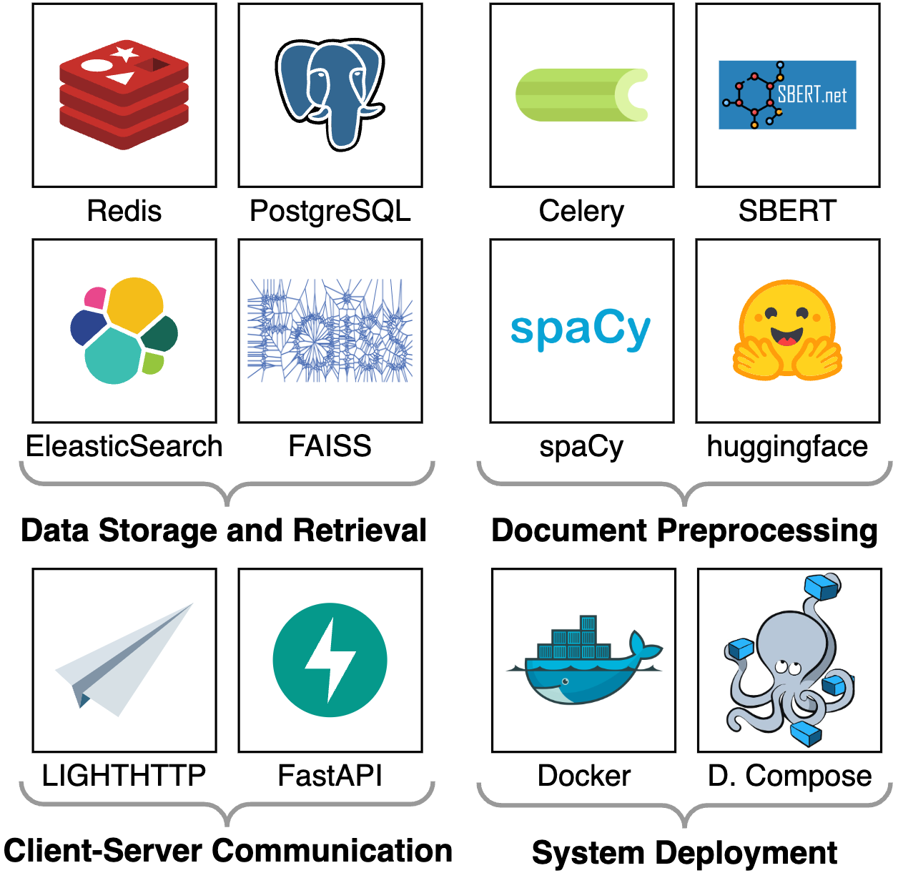

# D-WISE Tool Suite

This is the repository for the D-WISE Tool Suite (DWTS) - an outcome of
the [D-WISE Project](https://www.dwise.uni-hamburg.de/)

_Please also have a look at our [Wiki](https://github.com/uhh-lt/dwts/wiki) for more information and How-To's_

## Try it out!
- test the online demo at [https://dwts.ltdemos.informatik.uni-hamburg.de/](https://dwts.ltdemos.informatik.uni-hamburg.de/)
- host it on your own machine with `docker compose`
  - clone this repository: `git clone https://github.com/uhh-lt/dwts.git`
  - navigate to the docker directory: `cd dwts/docker`
  - run `docker compose up -d`
  - visit [http://localhost:3000/](http://localhost:3000/) in your browser

## Tech Stack

## License
Apache 2.0 - See [license file](LICENSE) for details
