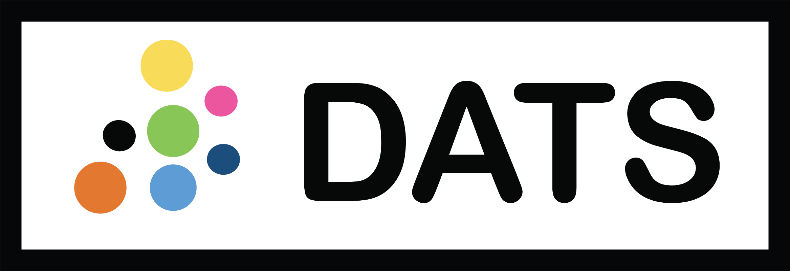
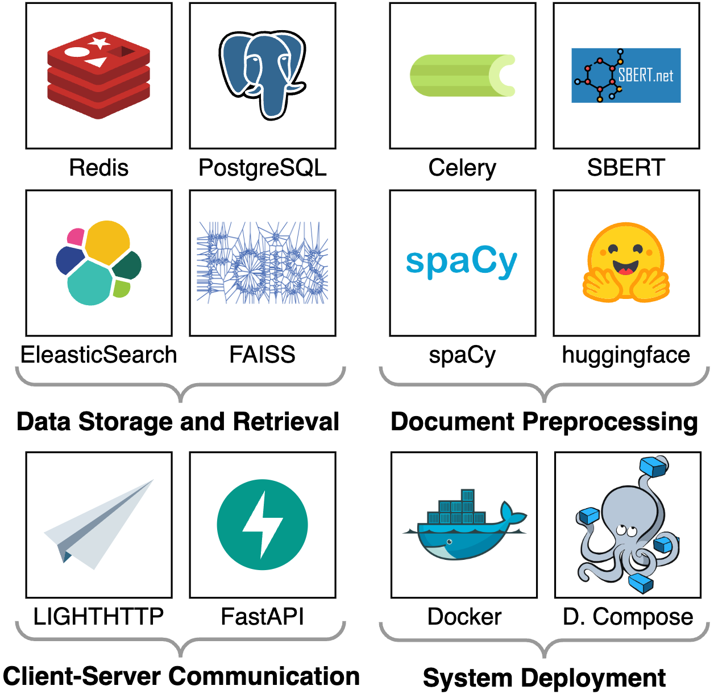

# Discourse Analysis Tool Suite (DATS)

This is the repository for the Discourse Analysis Tool Suite (dats) - an outcome of
the [D-WISE Project](https://www.dwise.uni-hamburg.de/)

_Please also have a look at our [Wiki](https://github.com/uhh-lt/dats/wiki) for more information and How-To's_

## Try it out!

- test the online demo at [https://dats.ltdemos.informatik.uni-hamburg.de/](https://dats.ltdemos.informatik.uni-hamburg.de/)
- host it on your own machine with `docker compose`
  - clone this repository: `git clone https://github.com/uhh-lt/dats.git`
  - navigate to the docker directory: `cd dats/docker`
  - create a copy of the .env.example file: `cp .env.example .env`
  - edit the .env example file and put in correct values for `UID`, `GID`, and `JWT_SECRET`
  - run `docker compose -f docker-compose-ollama.yml up -d` to start Ollama
  - run `docker compose up -d` to start the Tool Suite
  - visit [http://localhost:13100/](http://localhost:13100/) in your browser

## Tech Stack

## License

Apache 2.0 - See [license file](LICENSE) for details
