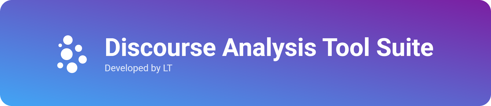
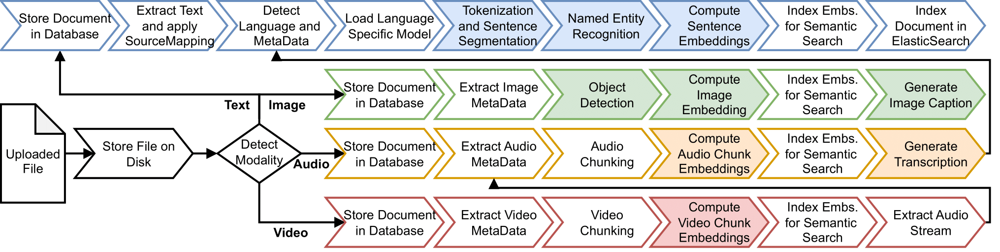
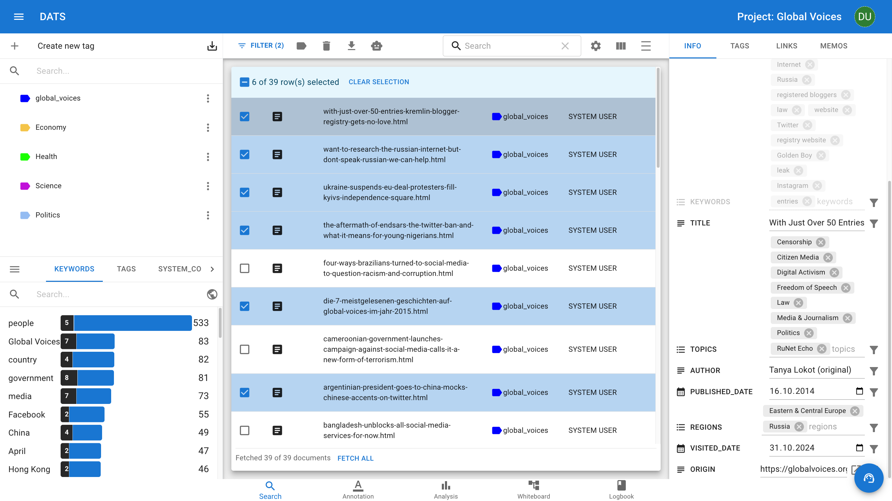
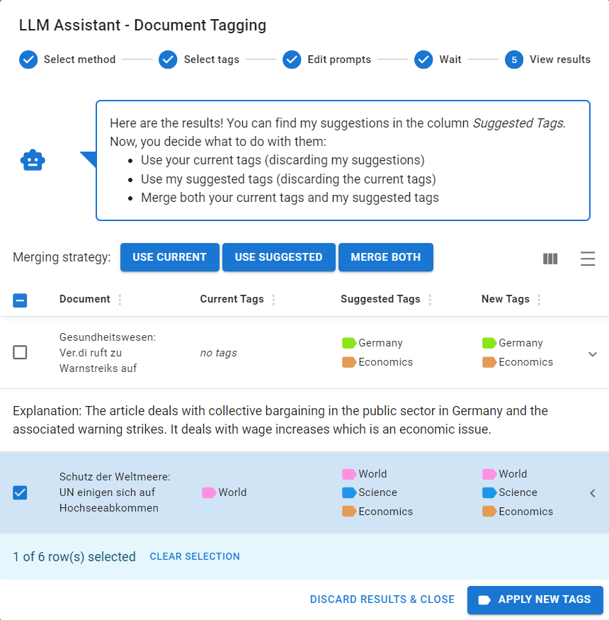
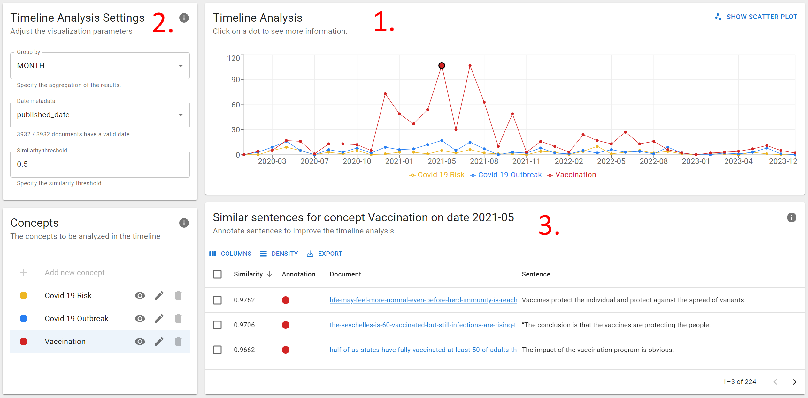
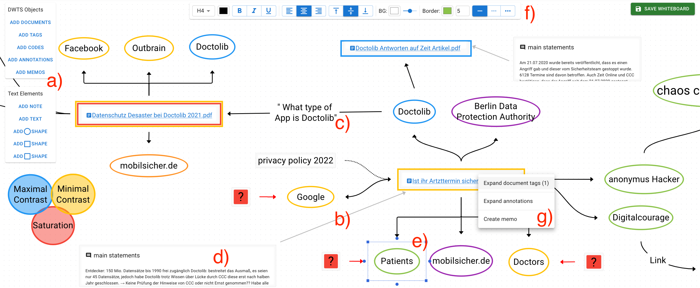

<div align="center">



**The AI-powered platform for multi-modal discourse analysis.**

<br/>

<p>
  <a href="#quick-start">Quick start</a> •
  <a href="#why-dats">Why DATS?</a> •
  <a href="https://dats.ltdemos.informatik.uni-hamburg.de">Demo</a> •
  <a href="https://github.com/uhh-lt/dats/wiki/User-Guide">User Guide</a> •
  <a href="https://github.com/uhh-lt/dats/wiki/FAQ">FAQ</a> •
  <a href="https://github.com/uhh-lt/dats/wiki">Wiki</a> •
  <a href="https://www.dwise.uni-hamburg.de/">D-WISE</a>
</p>

<p>
    <a href="https://dats.ltdemos.informatik.uni-hamburg.de"></a>
    <a href="https://github.com/uhh-lt/dats/blob/main/LICENSE"></a>
    <a href="https://results.pre-commit.ci/latest/github/uhh-lt/dats/mwp_v1"></a>
    <a href="https://github.com/uhh-lt/dats/releases"></a>
    <a href="https://aclanthology.org/2023.acl-demo.31/"></a>
</p>

</div>

---

# Discourse Analysis Tool Suite (DATS)

DATS is a machine-learning powered web application for multi-modal discourse analysis.
It provides tools for the typical workflow of a discsourse analysis project including data collection, data management, exploration, annotation, qualitative & quantitative analysis, interpratation and reflection.
See the [Features](#features) section to learn more about the various functionalities.

## Why DATS?

- Multi-modal: Support for 📝 text, 🖼 image, 🎵audio, and 🎞 video documents
- Multi-lingual: Support for 🇺🇸 english, 🇩🇪 german, 🇮🇹 italian and more
- ⚙️ Extensive pre-processing (e.g. automatic transcriptions, entity identification, keyword extraction, ...) ease data mangement
- 🤖 AI Assistance: state-of-the-art machine-learning and large language models assist with time-consuming tasks
- 👥 Collaborate with your team in shared projects
- 📥 Export data to continue your project with other tools
- 💻 No software installation or special hardware is required
- 🔓 Free open source software

## Quick start

The best way to get started is to watch our [Tutorial Video Series](https://www.youtube.com/watch?v=_ft3RvKhyXM&list=PLVRi8E_6wxgQV4MOAMIkRhhnjCC_JqvTb), read the [User Guide](https://github.com/uhh-lt/dats/wiki/User-Guide), and play with DATS on our [Demo Instance](https://dats.ltdemos.informatik.uni-hamburg.de/).

<details>
  <summary>Host it yourself</summary>

#### 0. Requirements

- Machine with NVIDIA GPU
- Docker with NVIDIA Container Toolkit

#### 1. Clone the repository

```bash
git clone https://github.com/uhh-lt/dats.git
```

#### 2. Run setup scripts

```bash
./bin/setup-envs.sh --project_name dats --port_prefix 101
```

```bash
./bin/setup-folders.sh
```

#### 3. Start docker containers

```bash
docker compose -f compose.vllm.yml up -d
```

```bash
docker compose -f compose.ray.yml up -d
```

```bash
docker compose -f compose.yml -f compose.production.yml up --wait
```

#### 4. Open DATS

Open [https://localhost:10100/](https://localhost:1-100/) in your browser

</details>

<details>
  <summary>Ask for a hosted instance</summary>

#### Hosted instance @ HCDS

We may be able to host DATS for your research institute.
Please contact the House of Computing and Data Science (HCDS) [here](https://www.hcds.uni-hamburg.de/en/hcds.html).

</details>

## Further reading

- **User Guide**: If you want to use DATS, we recommend to start looking at the [Features](#features) below and playing around with the tool. If you have questions, you may find help in the [User Guide](https://github.com/uhh-lt/dats/wiki/User-Guide) or in the [FAQ](https://github.com/uhh-lt/dats/wiki/FAQ). If you encounter problems or bugs, please leave us some [feedback](#feedback).
- **Admin Guide**: See the [quick start](#quick-start) guide above. For more information on how to configure DATS on a server, please see the [Admin Guide](https://github.com/uhh-lt/dats/wiki/Admin-Guide).
- **Developer Guide**: DATS is open source software. If you want to contribute to the project, please start with the [Developer Guide](https://github.com/uhh-lt/dats/wiki/Developer-Guide).

## Feedback?

DATS is still under development, so please feel free to give us feedback, tell us your wishes or report bugs:

- For feedback, please write [us](https://www.inf.uni-hamburg.de/en/inst/ab/lt/people/tim-fischer.html)
- To report bugs, please open an issue on [GitHub](https://github.com/uhh-lt/dats/issues)

<br/>

# Features

## Data collection

DATS can handle most data formats for text, image, audio, and video documents.
You can easily upload your files to DATS.
It also offers an integrated crawler implemented with Scrapy and Beautifulsoup to scrape websites and their images in case additional material is required.

## Data pre-processing

<!-- <div align="center" style="margin: 10px">
    
</div> -->


DATS automatically pre-processes documents as they are uploaded.
This process extracts metadata and enriches the material with additional information, including:

- Named entity recognition (people, organizations, locations, etc.)
- Object detection in images and videos (cars, people, buildings, etc.)
- Image captioning
- Automatic speech recognition (transcription)

This feature enables you to precisely filter documents by keywords, entities, and other criteria later on.

## Data management



DATS makes it easy to organize and analyze your data.
Each document can be assigned metadata – some of which DATS detects automatically – to help you categorize and find what you need.
You can also add your own tags to documents.

Filtering and search options let you quickly sift through your data.
Find documents containing specific keywords, entities (like people, organizations, or locations), or other criteria.
This flexible system keeps you in control of your data and ensures you can quickly find the information that matters most to your research.



DATS offers an AI Assistant that can help you streamline your data management tasks.
The AI Assistant can suggest tags and extract metadata for your documents, making it even easier to organize data.

Read more about LLM Assistance in our publlication [Exploring Large Language Models for Qualitative Data Analysis](https://aclanthology.org/2024.nlp4dh-1.41/).

## Exploration

DATS makes exploring your data easy and intuitive.
Its similarity search allows you to quickly find related documents, even across different modalities.

Found an interesting article? DATS can instantly find others like it.
Discovered a key image? DATS can locate similar images, or even text documents that relate to the same concept.
This cross-modal capability unlocks new ways to explore connections within your data.
This feature may help you to uncover hidden connections between documents and gain a deeper understanding of your data.

Further, when viewing search results, DATS presents an overview of the most frequent keywords, tags, and entities found within those documents.
This frequency analysis feature allows you to:

- Spot key themes: Quickly grasp the main topics being discussed.
- Discover new avenues for research: Identify potentially relevant keywords or entities you hadn't previously considered.
- Refine your searches: Use the frequency list to add new search terms or filters, leading you to new documents and a deeper understanding of your corpus.

## Annotation

DATS provides tools for text (span & sentence) and image annotation.
Annotating audio and video documents directly is not (yet) supported.
Instead, the automatically generated transcript can be used.

For example, the sentence annotator enables you to:

- Highlight important passages: Easily mark key sections of the text.
- Develop a code hierarchy: Create a structured taxonomy of codes and sub-codes to organize your analysis. DATS's interface - allows you to easily manage and update this code hierarchy as your research evolves.
- Collaborate with others: Codes and annotations are shared with colleagues, fostering teamwork and discussion.


The AI Assistant integrated in DATS can also help you with the annotation process.
It can suggest relevant text annotations, which you can then review and accept or reject.
This can save you a lot of time and effort, especially if you are working with a large dataset.

Read more about the Sentence Annotation feature in our publication [Semi-automatic Sequential Sentence Classification in the Discourse Analysis Tool Suite](https://www.inf.uni-hamburg.de/en/inst/ab/lt/people/tim-fischer.html).

## Analysis

DATS offers various tools for qualitative and quantitative analysis including Word- and Code-Frequency, or timeline analyses.
The more-advanced Concept-over-time analysis is explained below.

### Concept-over-time Analysis



DATS includes Concept Over Time Analysis, a feature that allows you to visualize how concepts evolve over time within your data.
With the Concept Over Time Analysis feature, you can:

- Define and refine your concepts of interest.
- Visualize the occurrence of concepts over time.
- Uncover patterns, trends, and shifts in discourse.
- Gain a deeper understanding of how concepts change.

To use Concept Over Time Analysis, you first define the concepts you are interested in.
For example, if you are interested in the concept of "democracy", you would provide a short description of what you mean by "democracy".
DATS uses this description to identify relevant sentences in your data.
You can then review these sentences and provide feedback to DATS, which helps to refine the concept and improve the accuracy of the analysis.
Finally, the occurrence of the concept over time analysis are visualized.

DATS's Concept Over Time Analysis is a valuable tool for qualitative data analysis, providing a unique perspective on the dynamics of discourse.
Read more about COTA in our publication [Concept Over Time Analysis: Unveiling Temporal Patterns for Qualitative Data Analysis](https://aclanthology.org/2024.naacl-demo.15/).

## Interpretation



DATS features interactive Whiteboards that provide a customizable graph-based interface to organize and manipulate your research objects and analyses.
With Whiteboards, you can:

- Visualize your data and analyses in a flexible and customizable way.
- Organize and refine your code taxonomies.
- Keep track of your research process and findings.
- Create a variety of visualizations, including sampling maps and actor networks, to gain new insights into your data.

To use Whiteboards, you simply drag and drop your research objects onto the canvas. You can then connect them with edges to represent relationships between them. You can also add text, shapes, and images to your Whiteboards to further annotate your data. Whiteboards are a powerful way to interact with your data, making it easier to conduct qualitative data analysis and uncover hidden connections.

Read more about the Whiteboards in our publication [Extending the Discourse Analysis Tool Suite with Whiteboards for Visual Qualitative Analysis](https://aclanthology.org/2024.lrec-main.615/).

## Reflection

DATS provides tools for reflection and documentation that are seamlessly integrated into your workflow, helping you to capture and organize your thoughts throughout the research process:

- Memos: Capture your thoughts and ideas as you work by attaching notes to documents, annotations, codes, and tags. This ensures that valuable insights are not lost and provides a rich record of your evolving interpretations.
- Logbook: Summarize your findings and document your research process in a logbook. You could use it to track your progress, identify patterns in your analysis, or ensure the transparency and reproducibility of your research.
