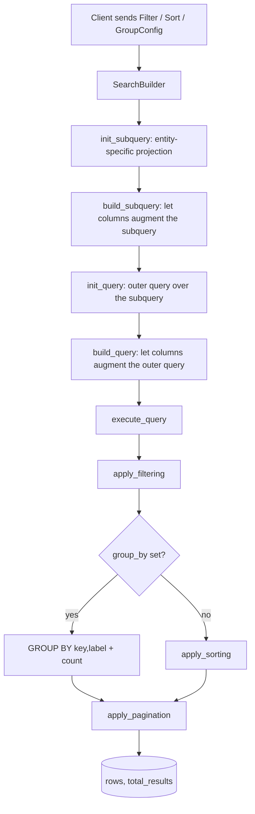

# Search System

A generic, entity-agnostic engine for **filtering, sorting, grouping, and paginating**
SQLAlchemy queries. It powers the search/table views for source documents, span /
sentence / bbox annotations, word frequencies, and memos.

The system is built around one idea: **each searchable entity describes its searchable
columns as an enum, and the engine drives the query generically from that enum.**

---

## Table of contents

- [Big picture](#big-picture)
- [Core concepts](#core-concepts)
  - [The column enum (`AbstractColumns`)](#the-column-enum-abstractcolumns)
  - [The two-phase query (`SearchBuilder`)](#the-two-phase-query-searchbuilder)
  - [The subquery dictionary (`subquery_dict`)](#the-subquery-dictionary-subquery_dict)
- [Filtering](#filtering)
- [Sorting](#sorting)
- [Grouping](#grouping)
  - [How grouping is meant to be used (the two-request pattern)](#how-grouping-is-meant-to-be-used-the-two-request-pattern)
- [Pagination](#pagination)
- [Column metadata (`ColumnInfo`)](#column-metadata-columninfo)
- [How to add a new searchable entity](#how-to-add-a-new-searchable-entity)
- [Worked example: memo search](#worked-example-memo-search)
- [File map](#file-map)

---

## Big picture



The engine never knows *which* entity it is searching. It only knows the column enum
and the hooks that enum provides.

---

## Core concepts

### The column enum (`AbstractColumns`)

Every searchable entity defines an enum that inherits from
[`AbstractColumns`](abstract_column.py). Each member is one searchable/sortable/
groupable column. The enum is the **single source of truth** for what can be done with
that entity's search.

The enum implements a set of **hooks**. The engine calls these hooks; it never
hardcodes entity specifics.

| Hook | Purpose | Called from |
|------|---------|-------------|
| `get_filter_column(subquery_dict)` | SQL expression used in `WHERE` for this column | filtering |
| `get_sort_column(subquery_dict)` | SQL expression used in `ORDER BY` for this column | sorting, `ColumnInfo` |
| `get_filter_operator()` | Which operator family (string, id, date, ...) the column supports | `ColumnInfo` |
| `get_filter_value_type()` | How the frontend should render the value picker | `ColumnInfo` |
| `get_label()` | Human-readable column label | `ColumnInfo` |
| `get_group_expressions(subquery_dict, date_granularity)` | SQL expressions for `GROUP BY` (key/label/targets) | grouping |
| `is_groupable()` | Whether the column supports grouping (capability flag) | `ColumnInfo` |
| `add_subquery_filter_statements(builder)` | Augment the **subquery** (add columns, joins) | `build_subquery` |
| `add_query_filter_statements(builder)` | Augment the **outer query** (joins) | `build_query` |
| `resolve_ids(db, ids)` | Map DB ids -> display names (for filter round-trips) | filtering |
| `resolve_names(db, project_id, names)` | Map display names -> DB ids | filtering |

> **Not every column supports every operation.** Return `None` from
> `get_sort_column` (non-sortable) or `get_group_expressions` (non-groupable) to
> opt out. Groupability is additionally **declared** via `is_groupable()` (default
> `False`), which is what the frontend sees — see [Grouping](#grouping).

### The two-phase query (`SearchBuilder`)

[`SearchBuilder`](search_builder.py) builds queries in **two phases**:

1. **Subquery** — selects the entity id plus every column needed for filtering,
   sorting, or grouping. This is where expensive joins and aggregations live, so they
   are computed once and reused.
2. **Outer query** — selects from the subquery and applies the generic
   filter/sort/group/pagination logic.

Lifecycle (strict order — each step validates the previous):

```python
builder = SearchBuilder(db, filter=..., sorts=..., group_by=..., user_id=...)
builder.init_subquery(entity_specific_projection)   # 1. provide the base projection
subquery = builder.build_subquery()                  # 2. columns augment + freeze it
builder.init_query(db.query(subquery.c.id))          # 3. outer query over subquery
builder.build_query()                                # 4. columns augment outer query
rows, total = builder.execute_query(page_number, page_size)
```

`SearchBuilder` collects the set of **affected columns** (from the filter tree, the
sorts, and the group-by field) and only asks *those* columns to augment the queries —
so unused joins are never added.

### The subquery dictionary (`subquery_dict`)

After `build_subquery()`, the subquery's columns are exposed as
`subquery.c` — a `ReadOnlyColumnCollection` keyed by column **label**. The engine
passes this dict into `get_filter_column`, `get_sort_column`, and
`get_group_expressions` so columns can reference **computed/joined expressions**
(e.g. an author's full name, an attached-object label) rather than only base ORM
columns.

This is what makes "sort by author name" or "group by source document name" possible:
the name lives in the subquery, and the column resolves it via
`subquery_dict["author_label"]`.

> **Metadata columns** are special: a filter/sort on project metadata uses an
> `int` column (the `ProjectMetadata` id) instead of an enum member. The engine
> materializes these as subquery columns labelled `METADATA-<id>` and resolves them
> via `subquery_dict[f"METADATA-{id}"]`.

---

## Filtering

[`filtering.py`](filtering.py) turns a JSON filter tree into SQL.

- **`Filter[T]`** — a node with a `logic_operator` (`and`/`or`) and a list of
  `items`, each either a `FilterExpression[T]` (leaf) or a nested `Filter[T]`
  (subtree). This is a recursive tree of arbitrary depth.
- **`FilterExpression[T]`** — one `column` + `operator` + `value`.
- **Operators** ([`filtering_operators.py`](filtering_operators.py)) — typed operator
  enums (`StringOperator`, `IDOperator`, `DateOperator`, `BooleanOperator`,
  `NumberOperator`, `ListOperator`, `IDListOperator`, `IDListRecursiveOperator`).
  Each has an `apply(column, value)` that returns a SQLAlchemy expression and
  validates the value's Python type.

**Name/id resolution.** Filters can be expressed in terms of display names or ids.
`Filter.resolve_names` / `Filter.resolve_ids` walk the tree and convert between the
two using the column's `resolve_names` / `resolve_ids` hooks. This lets the frontend
store human-readable filters while the backend filters on stable ids.

**Recursive filtering.** `IDListRecursiveOperator.CONTAINS_RECURSIVE` expands a
parent id (tag/code/folder) into all descendant ids via a recursive CTE
(`get_descendant_ids`) before filtering.

Entry point: `apply_filtering(query, filter, subquery_dict)`.

---

## Sorting

[`sorting.py`](sorting.py) — a `Sort[T]` is a `column` + `direction`
(`SortDirection.ASC`/`DESC`). `apply_sorting` orders the query by each sort in turn.

`Sort.get_sqlalchemy_expression` resolves the column through
`column.get_sort_column(subquery_dict)`, so a column can sort by a **label** rather
than a raw id. For example, memo search sorts "by author" using the subquery's
`author_label` (the person's name) instead of `user_id` — sorting by id would order
users by registration order, which is meaningless.

All sorts apply `.nulls_last()` so rows missing a value sink to the bottom regardless
of direction.

---

## Grouping

[`grouping.py`](grouping.py) — grouping aggregates the filtered result set into
buckets, each with a count.

- **`GroupConfig[T]`** — `field` (a column enum member) + optional `date_granularity`.
- **`GroupExpressions`** — what a column returns from `get_group_expressions`:
  - `key` — the expression that **defines the partition** (an id, a date bucket, a
    first letter, a boolean flag). Grouping is *always* by key, never by label, so
    two different objects that happen to share a name are never merged.
  - `label` — the human-readable name shown as the group header. It is functionally
    dependent on the key, so adding it to `GROUP BY` does not change the partition;
    it exists so groups can be **ordered alphabetically** and displayed without a
    second lookup.
  - `target_id` / `target_type` *(optional)* — identify the object a group points to,
    enabling drill-down navigation (e.g. "open this source document").
- **`DateGranularity`** — `day`/`week`/`month`/`year`, used to bucket date columns.

**Ordering of groups.** Groups with a missing key (`NULL`, coalesced to
`NONE_GROUP_KEY = "__none__"`, defined in `grouping.py`) are always sorted last.
Date groups are ordered by `key` descending (newest bucket first); all other groups
by `label` ascending (alphabetical).

Entry point: `apply_grouping(query, group_by, subquery_dict)` — the grouping analogue
of `apply_filtering` / `apply_sorting`. It resolves the column's `GroupExpressions`,
rewrites the query to select `(group_key, group_label, total_results[, target_id,
target_type])`, applies the `GROUP BY`, and orders the groups as described above.
`SearchBuilder.execute_query` calls it when `group_by` is set.

Grouping is **opt-in** and **declared**: a column supports it only if it (a) returns
`True` from `is_groupable()` and (b) overrides `get_group_expressions` to return a
`GroupExpressions` instead of `None`. The two must agree — `is_groupable()` is the
cheap, side-effect-free capability flag the engine reports to the frontend via
`ColumnInfo.groupable` (it needs no built subquery, so it can be probed at any time),
while `get_group_expressions` builds the actual SQL during `execute_query`. The
defaults on `AbstractColumns` (`is_groupable() -> False`,
`get_group_expressions(...) -> None`) make every column non-groupable unless it
explicitly opts in.

### How grouping is meant to be used (the two-request pattern)

Grouping is an **aggregate + drill-down** design, not "return all rows pre-grouped."
A grouped view is built from **two kinds of requests**:

1. **Group query** — `POST /search/{entity}/groups` with a `GroupQueryRequest`
   (`filter` + `group_by`). Returns a `GroupPage` of `GroupSummary` buckets:
   `(key, label, total_results, target_id, target_type)`. **No rows here** — just the
   group headers and their counts. This is cheap and drives the accordion headers.

2. **Drill-down row query** — `POST /search/{entity}` with a normal `QueryRequest`
   that *also* sets `group_by` **and** `group_key` to one bucket's `key`. The row
   query then filters to just that group (`exprs.key == group_key`) and returns a
   `Page[Row]` of the rows inside it. `group_by` without `group_key` has no effect on
   a row query.

The intended UX is an **expand-on-demand accordion**: fetch the group headers once,
expand the first group by default (one drill-down), and fire a drill-down only when
the user expands another group. So initial load is **2 requests** (groups + first
group's rows), never N+1 — you never fetch rows for collapsed groups.

**Why not return rows inside the groups in one request?** Because there are two
independent pagination axes — which *groups* (page of `GroupPage`) and which *rows
within a group* (a group may have hundreds of rows). Keeping them as separate
requests keeps each query a single simple SQL shape and lets the two paginations
compose cleanly. Fusing them would require window functions / batched subqueries and
a fused pagination model — more complexity and more bug surface for no benefit in the
expand-on-demand model.

**Frontend recipe for one expanded group:** call the drill-down with `page_number=0`
and your `page_size`, and use that group's `total_results` (already on the
`GroupSummary`) to drive its "load more" / pagination.

---

## Pagination

[`pagination.py`](pagination.py) — `apply_pagination(query, page_number, page_size)`
returns the paginated query plus a `Pagination(page_number, page_size, num_pages,
total_results)` namedtuple. `total_results` is computed with `query.count()`, which
works for both plain and grouped queries. `SearchBuilder.execute_query` converts its
0-based `page_number` to this module's 1-based convention.

---

## Column metadata (`ColumnInfo`)

[`column_info.py`](column_info.py) — `ColumnInfo.from_column(column)` builds a
self-description of one column for the frontend: its `label`, whether it is
`sortable` (probed via `get_sort_column(...) is not None`), whether it is
`groupable` (declared via `is_groupable()`), its `operator` family, and its `value`
type. The frontend uses this to render the filter dialog and decide which columns can
be sorted/grouped. Project-metadata columns get a `ColumnInfo` via
`from_project_metadata` (always `sortable=True`, `groupable=False`).

---

## How to add a new searchable entity

1. **Define the column enum** inheriting `AbstractColumns`, with one member per
   searchable column. Implement the hooks you need (`get_filter_column`,
   `get_sort_column`, `get_filter_operator`, `get_filter_value_type`, `get_label`).
   To make a column groupable, override `is_groupable()` to return `True` **and**
   implement `get_group_expressions` for it.
2. **Build the base projection** — a SQLAlchemy query selecting the entity id and any
   computed/label columns, with the joins they need. Pass it to
   `builder.init_subquery(...)`.
3. **Wire the service** — construct a `SearchBuilder`, run the lifecycle, and map the
   resulting rows to your response DTO. Provide a row query (`find_<entity>` ->
   `Page[XRow]`) and, if any column is groupable, a group query
   (`find_<entity>_groups` -> `GroupPage`).
4. **Expose `ColumnInfo`** so the frontend can discover the columns (including their
   `sortable` / `groupable` flags).

Reuse the generic request/response DTOs — `QueryRequest[T]` / `Page[XRow]` (from
[`modules/search/search_dto.py`](../../modules/search/search_dto.py)) for row
queries and `GroupQueryRequest[T]` / `GroupPage` for group queries — so the API shape
stays consistent across entities.

---

## Worked example: memo search

Memo search ([`modules/search/memo_search`](../../modules/search/memo_search/)) is the
most complete consumer of the engine:

- [`memo_search_columns.py`](../../modules/search/memo_search/memo_search_columns.py)
  defines `MemoColumns` and `build_memo_subquery(db, project_id, user_id)` — a
  10-table projection that resolves, per memo, the attached object's type/id/label,
  the source-document and code context labels, the author's name, and the per-user
  favorite flag. Every column except `CONTENT` is groupable (`is_groupable()`).
- [`memo_search.py`](../../modules/search/memo_search/memo_search.py)
  - `find_memos` — the builder filters/sorts/paginates to a page of memo **ids**,
    then re-runs the projection restricted to those ids to build rich `MemoSummary`
    rows (labels included) in the correct order. Returns the unified
    `Page[MemoSummary]`.
  - `find_memo_groups` — the builder's grouping branch returns aggregate rows
    `(group_key, group_label, total_results, target_id, target_type)` directly,
    mapped to the shared `GroupSummary` / `GroupPage`.

Both functions take the unified request DTOs (`QueryRequest[MemoColumns]` /
`GroupQueryRequest[MemoColumns]`) defined in
[`modules/search/search_dto.py`](../../modules/search/search_dto.py) and
[`grouping.py`](grouping.py), so the API shape is identical to span/sentence/bbox
search. Stored memo views ([`core/memo/memo_view_dto.py`](../../core/memo/memo_view_dto.py))
reuse the same `GroupConfig[MemoColumns]` and `Sort[MemoColumns]` types and validate
groupability via `MemoColumns.is_groupable()` — there is no separate view-specific
grouping enum.

This illustrates the house pattern: **SearchBuilder narrows to ids (or aggregates to
group rows); the service resolves display data for just the returned page.**

---

## File map

| File | Responsibility |
|------|----------------|
| [abstract_column.py](abstract_column.py) | `AbstractColumns` — the hook contract every column enum implements |
| [search_builder.py](search_builder.py) | `SearchBuilder` — two-phase query construction + `execute_query` |
| [filtering.py](filtering.py) | `Filter` / `FilterExpression` tree, id/name resolution, recursive CTE |
| [filtering_operators.py](filtering_operators.py) | Typed operator enums + `FilterValue` / `FilterValueType` |
| [sorting.py](sorting.py) | `Sort`, `SortDirection`, `apply_sorting` |
| [grouping.py](grouping.py) | `GroupConfig`, `GroupExpressions`, `GroupSummary`, `GroupPage`, `GroupQueryRequest`, `DateGranularity`, `apply_grouping`, `NONE_GROUP_KEY` |
| [pagination.py](pagination.py) | `apply_pagination`, `Pagination` |
| [column_info.py](column_info.py) | `ColumnInfo` — column self-description for the frontend |
