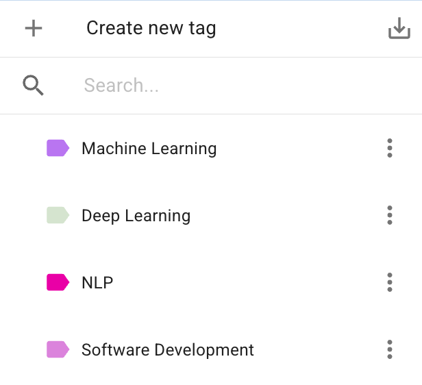
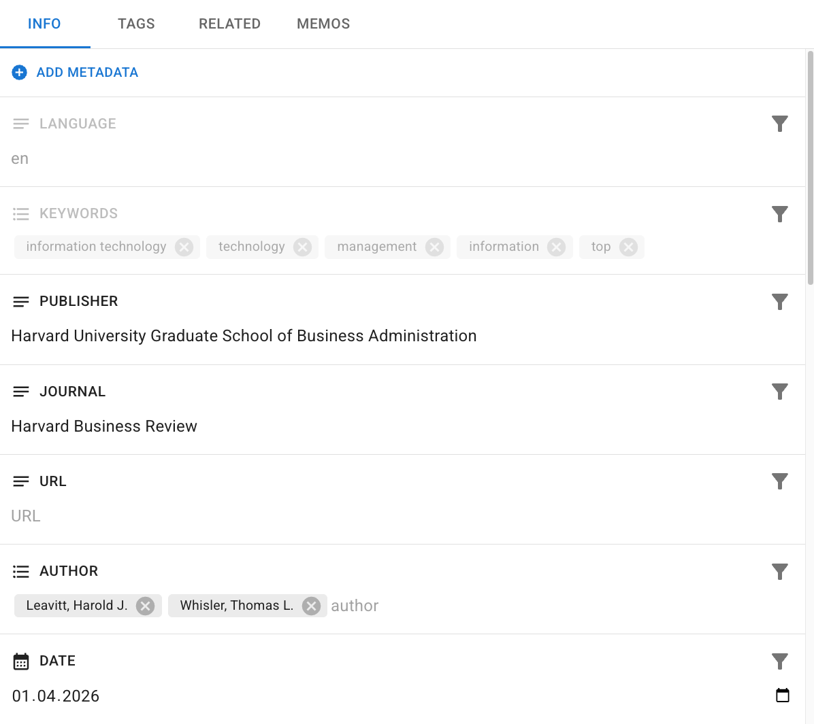
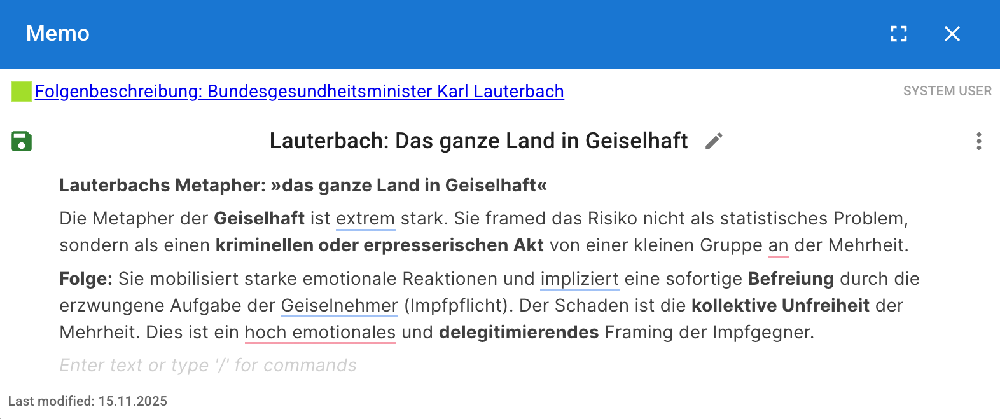

# Core Concepts & Systems

Before diving into the specific views and features of the DATS interface, it is essential to understand the foundational vocabulary and systems that organize your research materials. DATS uses a specific set of concepts to structure data, facilitate qualitative coding, and enable complex analysis.

This chapter defines the core systems you will interact with throughout the Discourse Analysis Tool Suite.

## Projects & Documents

The basic hierarchy in DATS starts with Projects and Documents.

* **Project:** A Project is your primary collaborative workspace. It contains all your uploaded files, created codes, tags, metadata definitions, and user settings for a specific research endeavor. Multiple users can be invited to collaborate within a single project.
* **File vs. Document:** When you upload raw data material (like a 300-page PDF), DATS processes it.
  * **File (or File-Folder):** This represents the original, entire item you uploaded.
  * **Document:** To optimize performance for large texts and to facilitate targeted analysis, DATS automatically splits large files into smaller, manageable chunks (typically 10-page segments). These individual segments are called **Documents**. Therefore, a single uploaded *File* may consist of one or many *Documents*, which are grouped together in a File-Folder.
  * *Note: Documents are modality-agnostic; they can be text, images, audio recordings, or videos.*

## The Tag System

The Tag system is used exclusively for **organizing and categorizing entire Documents**.

Tags act as colorful attributes that you can assign to documents to group them meaningfully. Because they apply to the *document level*, they are incredibly useful for managing your corpus, filtering search results, and defining specific subsets of data for analysis (e.g., creating a "Train" and "Test" set for machine learning).

* **Hierarchical Structure:** You can create a hierarchy of tags (e.g., a parent tag Domain with child tags Business, Popular, Research).
* **Multiple Assignments:** A single document can be assigned multiple different tags.

## The Code System

The Code system is the heart of your qualitative analysis. Unlike Tags, which apply to entire documents, Codes are used exclusively to **classify specific segments within a document**.

When you apply a Code to a specific text excerpt or a bounding box on an image, you create an **Annotation**.

* **The Codebook:** Your collection of codes forms your Codebook (or code-tree). Like Tags, Codes are organized hierarchically, allowing you to define broad categories with highly specific sub-codes.
* **System Codes vs. Custom Codes:**
  * **Custom Codes:** You define these based on your specific research questions and theoretical framework.
  * **System Codes:** During the automated import process, DATS applies predefined System Codes (like SYSTEM\_CODE: PERSON or SYSTEM\_CODE: LOCATION) using automatic entity recognition. These can be helpful for initial exploration.

## Annotations

An Annotation is the fundamental unit of your analysis. It is formed when you link a specific piece of raw data (the content) to a theoretical concept (the Code).

DATS supports several types of annotations depending on the document modality:

* **Span Annotation:** Used for text. You select an arbitrary sequence of words (a span) and assign a Code to it.
* **Sentence Annotation:** Used for text. You assign a Code to an entire, discrete sentence.
* **Bounding Box Annotation:** Used for images. You draw a rectangular box over a specific segment of the image and assign a Code to it.

*Because DATS automatically transcribes audio and video files during import, you analyze these modalities by creating Span or Sentence annotations on their generated transcripts.*

## The Metadata System

Metadata consists of arbitrary key-value pairs associated with a Document, providing descriptive, contextual, or statistical information.

Metadata is crucial for advanced filtering and timeline analyses.

* **Automatic Metadata:** During import, DATS automatically extracts and generates metadata such as language, keywords, word count, and publication date.
* **Custom Metadata:** You can define custom metadata fields (text, lists, numbers, dates) to store additional information relevant to your project, such as Author, Publisher, or Journal.

## The Memo System

Memos are the omnipresent tool for capturing your interpretive thoughts, reflections, and sudden insights during the research process.

Think of Memos as digital "post-it" notes. They consist of a title and structured text content.

* **Ubiquity:** A Memo can be attached to virtually *any* research object in DATS: a Document, a Tag, a specific Code in your codebook, or an individual Annotation you just created.
* **Visibility:** Memos are visible to all other users in your project, making them an excellent tool for team communication, noting uncertainties, or documenting the evolution of your code definitions.
