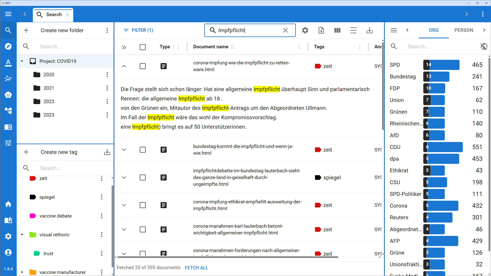

# The DATS Workspace (Global UI)

DATS is designed as a modern, single-page web application. This means that once you log in and open a project, your entire research process takes place within a single browser tab. You won't have to manage dozens of separate pop-up windows or constantly hit your browser's "Back" button.

Understanding the basic layout of the DATS workspace will help you navigate your data and tools efficiently.

## The Main Layout Structure

The DATS workspace is divided into three primary structural components:

1. **The Left Navigation Bar:** Your main menu for accessing all DATS features.
2. **The Top Tab Bar:** Your multi-tasking manager for open documents and analyses.
3. **The Central Workspace:** The flexible, resizable main area where your active work takes place.

## 1\. The Left Navigation Bar

Located at the far left edge of your screen, the Navigation Bar is your permanent anchor. It provides quick access to every tool and view within DATS.

The bar is divided into a top section for core research features, and a bottom section for tools, settings, and user management.

**Core Research Features (Top Section):**

* 🔍 **Search:** The gateway to your corpus. Explore folders, filter documents, manage tags, and search for keywords or semantic concepts.
* 📝 **Annotation:** The dedicated view for applying codes to specific text passages or image bounding boxes.
* 🗺️ **Perspectives:** Open the semantic clustering tool to discover latent similarities and group documents together.
* 📊 **Analysis:** A dashboard containing quantitative tools like Code Frequency, Word Frequency, and Timeline Analyses.
* 🧠 **Classifier Training:** Access the interface to train, evaluate, and apply custom Machine Learning classifiers based on your manual annotations.
* 🖼️ **Whiteboard:** Open the visual, Miro-like canvas to map out relationships, organize codes, and synthesize your interpretations.
* 📓 **Logbook:** Access the project Logbook and the unified Memo Explorer to review your research notes.
* 🧰 **Tools:** A dropdown menu containing utility features:
  * *Document Health:* Check the status of your documents' preprocessing pipeline (e.g., if text extraction or entity recognition succeeded or failed).
  * *Duplicate Finder:* Identify and manage duplicate documents within your corpus.
  * *Document Sampler:* A utility for creating specific subsets of your data.

**Settings (Bottom Section):**

* 🏠 **Home / Projects:** Return to the main project selection screen.
* 📖 **Guide:** A quick link out to this official user documentation.
* ⚙️ **Project Settings (Cog Icon):** Manage project details, add/remove users, edit the codebook and tags globally, and handle import/export functions.
* 👤 **User Profile:** Manage your personal account settings.

## 2\. The Top Tab Bar

Because discourse analysis requires looking at multiple pieces of information simultaneously, DATS uses a multi-tab system, much like your web browser.

Just above the central workspace is the **Top Tab Bar**.

* Every time you double-click a document in the Search view, or open a new Timeline Analysis or Whiteboard, it opens as a **new tab** in this bar.
* You can easily switch back and forth between different documents and tools without losing your place.
* Tabs can be rearranged by clicking and dragging them, and closed by clicking the "X" on the tab.

*Note: Below the Tab Bar, the active view will usually display its own specific **Toolbar** (e.g., search bars, filtering options, or rendering settings). The contents of this toolbar change depending on which tab you currently have active.*

## 3\. The Central Workspace & Resizable Panels

The center of your screen is where the actual work happens—reading documents, viewing charts, or drawing on whiteboards.

To help you manage complex information, the central workspace is highly flexible. Depending on what you are doing (like reading a document in the Annotation view), DATS will split the workspace into a main central area surrounded by smaller side panels (like the Code Explorer on the left, or Metadata/Memos on the right).

\!\!\! tip "Resizing your Workspace"

All these components of the window are separated from each other by blue dividing lines. **If you click on a blue line and drag it, you can resize the views.** This is incredibly useful if you need to make a document wider for easier reading, or expand a sidebar to read a long memo.

## Managing Your User Profile

Clicking the **User Icon** at the very bottom left of the Navigation Bar opens your personal User View in the central workspace.

Currently, this page allows you to manage your basic account security. You can use this view to:

* View your account email.
* Change your login email address.
* Update your password.
