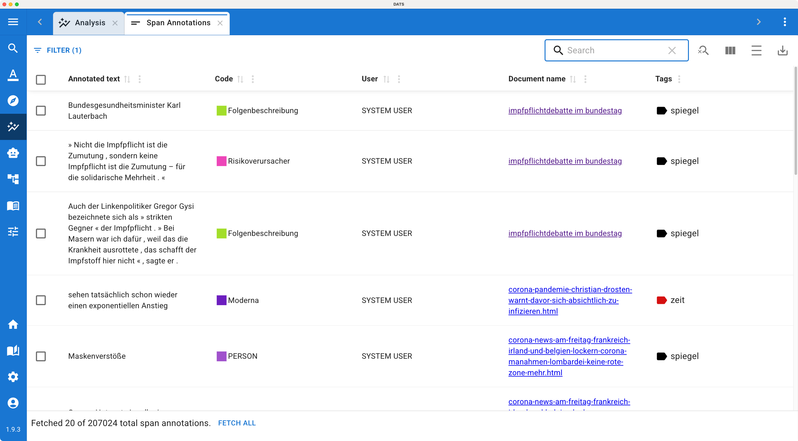

# Annotation Tables

While the Code Frequency and Timeline tools provide macro-level visualizations of your data, qualitative research often requires you to get back into the weeds to review, clean, and refine your coding. The **Annotation Tables** provide a centralized, highly searchable hub for exactly this purpose.

Instead of hunting through individual documents to find specific highlights, these tables aggregate every single annotation across your entire project into a customizable list.

## 1\. The Three Table Types

Because DATS supports different modalities and coding methods, there is not just one master table. When you open this feature from the Analysis Dashboard, you actually have access to three distinct tools, tailored to the type of annotation you want to review:

1. 📝 **Span Annotation Table:** Lists all arbitrary text selections (ranging from a single word to whole paragraphs).
2. 📝 **Sentence Annotation Table:** Lists all annotations snapped to full, discrete sentences.
3. 🖼️ **Bounding Box Annotation Table:** Lists all spatial annotations made over image documents.

You can switch between these tables depending on what aspect of your coding you are currently reviewing or cleaning.

## 2\. Navigating and Filtering the Tables

When you open an Annotation Table, you are presented with a comprehensive list of every annotation created in the project (including those made by the SYSTEM USER).

*The Annotation Table provides a bird's-eye view of all manual and automated coding.*

* **Customizing Columns:** Use the "Show/hide columns" button at the top right to select which metadata you want to see.
* **Sorting and Searching:** Click on any column header to sort the table. You can use the global search bar, or use the **Filter** menu to create complex queries (e.g., "Show me all annotations made by *User A* using the code *Economic Crisis*").
* **Filtering by Memos:** A highly useful feature for qualitative researchers is the "Memo Content" column. You can use this to filter the table to show *only* annotations where you or your team have written a specific interpretive memo!

!!! tip "Cluttered Screen?"

    If the text snippets in the table are long and the screen feels overwhelming, remember to use the **Toggle density (=)** button in the toolbar to compress the rows and see more entries at once.

## 3\. Bulk Editing and Data Cleaning

The true power of the Annotation Tables lies in their ability to help you clean up your codebook and fix mistakes across your entire corpus at once.

If you realize you have been using a code incorrectly, or if you decide to merge two concepts together, you do not need to open every single document to fix it.

1. **Search/Filter:** Use the table filters to isolate the specific annotations you want to change.
2. **Select Multiple Rows:** Use the checkboxes on the left side of the table to select individual annotations, or use the master checkbox in the header to select all visible rows.
3. **Bulk Edit:** Once annotations are selected, a **Pencil (Edit) icon** will appear at the top of the table (next to the filter button). Click it to instantly re-assign a new code to all selected annotations simultaneously!

*Select multiple annotations to quickly re-assign them to a new code.*

## 4\. Jumping to Context

Reviewing a snippet of text in a spreadsheet is often not enough to understand its true meaning.

If you see an annotation in the table and need to read the surrounding paragraphs to understand *why* it was coded that way, simply click on the **Document Name** in that row.

DATS will immediately open that document in a new tab, automatically scroll down to the exact location of the annotation, and highlight it for you.
