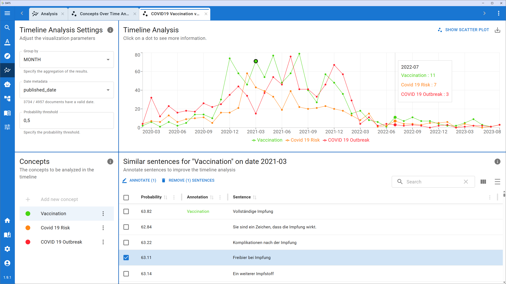

# Concept-over-Time Analysis (COTA)

While the standard Timeline Analysis tool is fantastic for tracking explicit metadata or keyword-based concepts, discourse analysis often requires tracking more complex, abstract, or latent themes that cannot be captured by simple filter rules.

To address this, DATS includes the **Concept-over-Time Analysis (COTA)**. COTA is an advanced, AI-assisted extension of the timeline tool. Instead of relying on static filters, COTA uses Large Language Models (LLMs) and a "human-in-the-loop" iterative process. You provide a qualitative description of a concept, the AI finds potential matches, and you iteratively refine those matches until the AI perfectly understands your theoretical framework.

*(Read more about the academic foundation of COTA in our publication: [Concept Over Time Analysis: Unveiling Temporal Patterns for Qualitative Data Analysis](https://aclanthology.org/2024.naacl-demo.15/)).*

## 1\. The COTA Interface

*The COTA interface manages the iterative "human-in-the-loop" refinement process.*

Because COTA involves iterative machine learning, its interface is slightly more complex than the standard timeline. It is divided into three main areas:

* **Top Left (Controls):** Where you initiate iterations and adjust model parameters.
* **Bottom Left (Concepts):** Where you define the qualitative descriptions of the themes you are tracking.
* **Right Side (Exploration):** A dynamic panel that switches between a **Graph View** (showing the timeline) and a **Data View** (where you interact with the AI's predictions).

## 2\. Defining Your Concepts

The first step in COTA is not to write filter rules, but to write a qualitative codebook definition.

1. In the bottom left panel, click to add a new concept.
2. Give your concept a name (e.g., "Democracy").
3. **The Crucial Step:** Write a detailed description of what this concept means in the context of your research.
   * *Example:* "This concept refers to discussions about representative government, voting rights, civic participation, and the rule of law. It does not include..."
   * DATS will use this exact description to instruct the LLM on what to look for in your text.

## 3\. The Iterative Refinement Process

COTA works in cycles (iterations). You do not just run it once; you train it.

### Iteration 1: Initial Discovery

1. Once your concepts are defined, go to the top left **Controls** panel and click **Start**.
2. The LLM will scan your corpus and attempt to find sentences that match your written descriptions.
3. When the job finishes, the right panel will switch to the **Data View**.

### Iteration 2: Human Feedback (The "Loop")

This is where the qualitative researcher takes control.

1. In the **Data View**, you will see a list of sentences the AI *predicts* belong to your concepts.
2. You must now review these predictions. If a sentence genuinely matches your concept of "Democracy," select it and assign it to that concept.
3. **Minimum Requirement:** You must manually code at least **5 sentences per concept** to provide the AI with enough context to learn.
4. Once you have coded enough examples, click **Start** in the Controls panel again.

### Iteration 3+: Refinement

The AI now uses both your original written description *and* the specific examples you just coded to run a new, far more accurate search across the corpus.

* You repeat this process—reviewing predictions, correcting them, and re-running the model—until the AI's predictions consistently align with your theoretical understanding of the concept.

## 4\. Visualizing the Timeline

Once you are satisfied with the AI's accuracy (after several iterations), you can switch the right panel from the Data View to the **Graph View**.

*After iterative training, switch to the Graph View to see the chronological evolution of your abstract concepts.*

* The Graph View displays a chronological timeline (similar to the standard Timeline tool), plotting the frequency of sentences the AI has classified under your concepts.
* This allows you to visualize the historical ebb and flow of complex, abstract discursive themes that would be impossible to track using simple keywords alone\!

\!\!\! tip "COTA vs. Standard Timeline"

Use the **Standard Timeline** when you know *exactly* what words or metadata you are looking for. Use **COTA** when you are tracking a nuanced narrative or theme where the vocabulary might change, but the underlying meaning remains the same.
