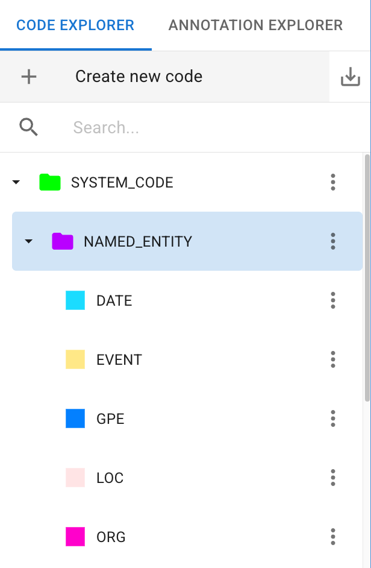
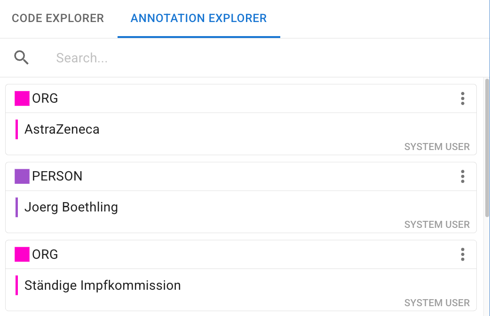
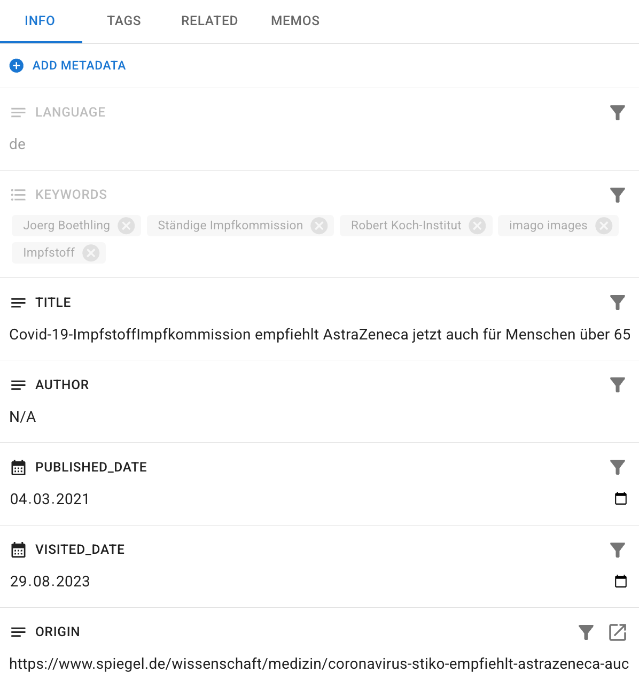

# The Annotation View

The Annotation View is the core qualitative workspace in DATS. Once you have used the Search View to find the documents you want to analyze, double-clicking a document will open it here in a new tab.

This view is specifically designed for deep reading and qualitative coding. It allows you to select text segments or image areas and link them to theoretical concepts from your Codebook.

*The Annotation View is optimized for deep reading and qualitative coding.*

## 1\. The Central Viewer & Top Toolbar

The center of the screen displays the actual content of your document. Just above the document is the Annotation Toolbar, which controls how you interact with the text or image.

### Selecting Your Active User (Crucial Step\!)

Before you make a single annotation, look at the **User Dropdown** in the top toolbar.

* **Always ensure your own user profile is selected.** Any annotations you create will be ascribed to the active profile.
* **Viewing others:** You can select a colleague's profile to view their annotations.
* **The SYSTEM USER:** During import, DATS automatically identifies entities (like people, locations, or organizations) and tags them under the SYSTEM USER profile using SYSTEM\_CODES. Selecting this profile is a great way to see an automated overview of the document's actors.

### Selecting an Annotation Mode

DATS supports different types of coding depending on your methodology and the document modality. Use the toolbar to toggle between:

1. **Reading Mode:** Hides annotation tools for clean, distraction-free reading.
2. **Span Annotation (Text):** Allows you to select arbitrary sequences of words (from a single word to whole paragraphs).
3. **Sentence Annotation (Text):** Forces selections to snap to whole, discrete sentences.
4. *(For Images)* **Bounding Box Annotation:** Automatically activated when viewing an image document, allowing you to draw rectangles over visual elements.

### The Compare View

If you are working in a team and want to check inter-coder reliability or simply review a colleague's work, click the **Compare** icon in the toolbar.

* This splits the central viewer side-by-side.
* You can view your annotations on the left and a colleague's on the right.
* You can even "take over" or apply annotations from their side to yours\!

### Rendering Settings & LLM Assistant

* **Rendering Settings:** Click the settings icon to change how annotations visually overlap the text (e.g., rendering code names inline with the text or stacked at the top of the highlighted span).
* **LLM Assistant:** The robot icon opens the AI Assistant dialog to help automate your annotation process. *(This feature is covered in detail in the [LLM Assistant Guide](http://docs.google.com/link-to-llm-guide)).*

## 2\. Making and Modifying Annotations

Once your profile and mode are set, you are ready to code.

**To Create an Annotation:**

1. **Select the content:** Click and drag your mouse over a text span, a sentence, or an area of an image.
2. **The Context Menu:** A small menu will instantly pop up.
3. **Choose a Code:** You can type to search for an existing code in your Codebook and hit **Enter**. DATS remembers your last-used code, making repetitive tagging very fast.
4. **Create on-the-fly:** If the code you want doesn't exist yet, simply type a new name and click the **Add** button in the pop-up to instantly add it to your Codebook.

*Highlighting text brings up the code selection menu.*

**To Modify an Annotation:**

Clicking on an existing annotation highlight in the text will open a quick-action menu:

* 📝 **Memo:** Add a qualitative "post-it" note to this specific annotation.
* ✏️ **Change Code:** Re-assign the highlighted text to a different code.
* ➕ **Duplicate:** Create a second annotation over the exact same span with a *different* code (useful for applying modifier codes or intersecting concepts).
* 🗑️ **Delete:** Remove the annotation entirely.

## 3\. The Left Sidebar: Code & Annotation Explorers

The left side of the screen is dedicated to managing your taxonomy and tracking the codes applied to the current document. You can toggle between two tabs at the top of this panel: **Code Explorer** and **Annotation Explorer**.

*Manage your hierarchical codebook from the Left Sidebar.*

### The Code Explorer

This tab displays your entire Codebook as a hierarchical tree.

* **Managing Codes:** Use the toolbar here to create new top-level codes. You can right-click any code to edit its color, name, or description, or to add child codes.
* **Hiding/Disabling:** Clicking the "Eye" icon next to a code hides all its annotations from the document viewer.
  \!\!\! tip "Pro-Tip: Filtering the Context Menu"
  If your Codebook is massive, the pop-up context menu in the main viewer can get overwhelming. **Click once on a top-level code in the Code Explorer.** Now, when you highlight text, the pop-up menu will *only* suggest that selected code and its specific children\! Click it again to remove the filter.

### The Annotation Explorer

This tab acts as an index for the current document. It displays a list of "cards" for every single annotation you (or the active user) have made in this file.

* **Navigation:** Clicking on any annotation card instantly scrolls the main viewer directly to that highlight.
* **Filtering:** Click the colorful squares at the bottom of the explorer to filter the list to show only specific codes.

## 4\. The Right Sidebar: Context & Metadata

The right sidebar is identical to the one found in the Search View. It provides vital context about the document you are currently reading.

*The Right Sidebar provides document context and navigation.*

It is divided into four tabs:

1. **INFO (Metadata):** View and edit the descriptive metadata (Author, Date, Source) for the document.
2. **TAGS:** View and edit the structural tags assigned to this document (e.g., Domain: News).
3. **RELATED:** *This is crucial for long files\!* If you uploaded a 300-page PDF, DATS split it into smaller documents. This tab lists all the other chunks of that original file. Use the **Next** and **Prev** buttons to easily flip to the next page of your book or article.
4. **MEMOS:** View or create memos attached to the *document as a whole*.
