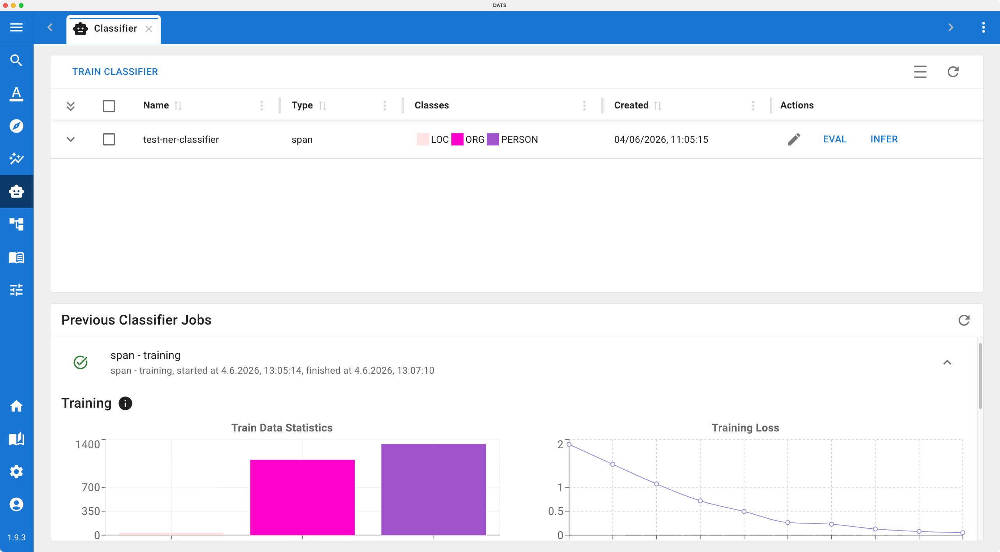
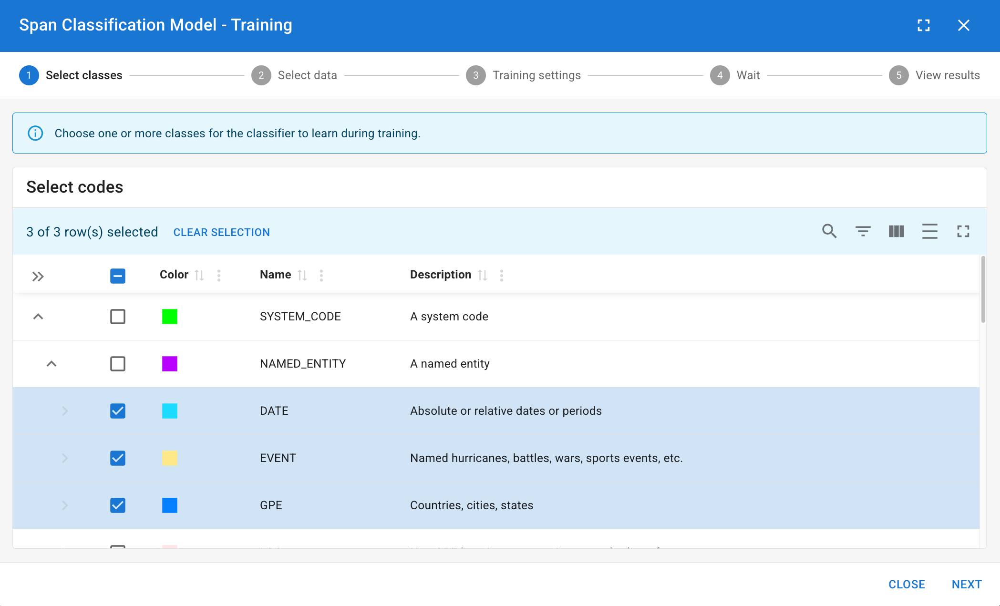
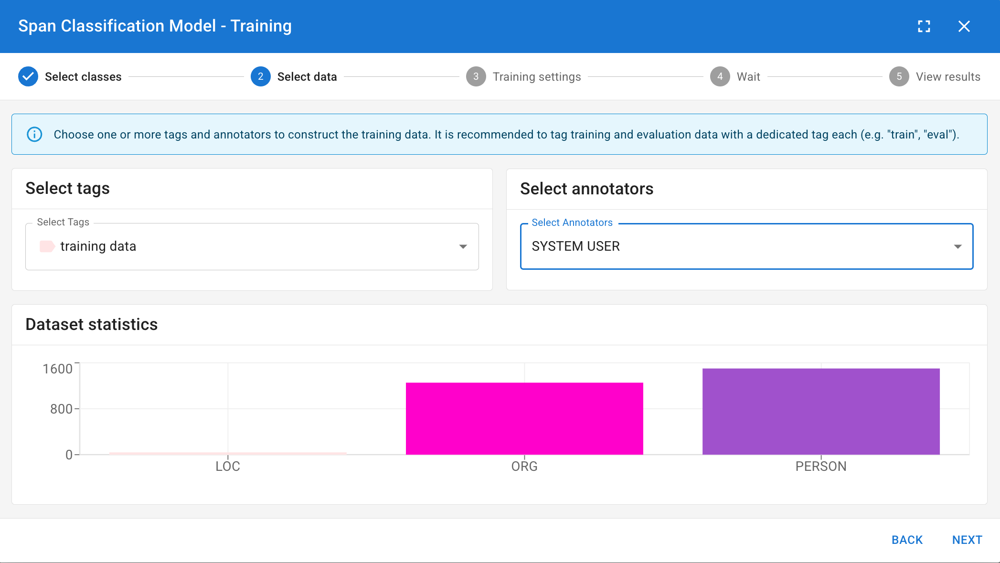
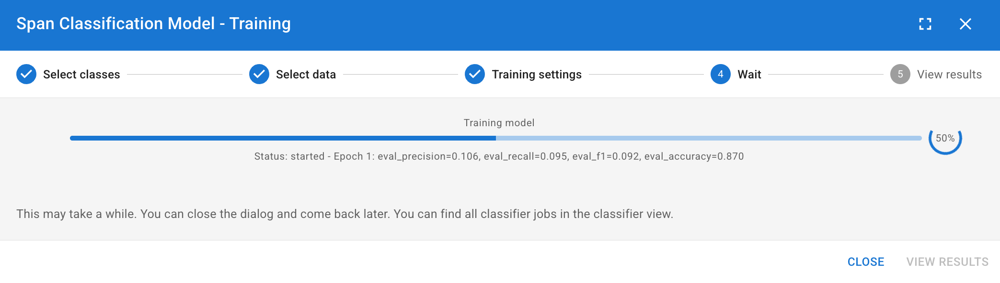
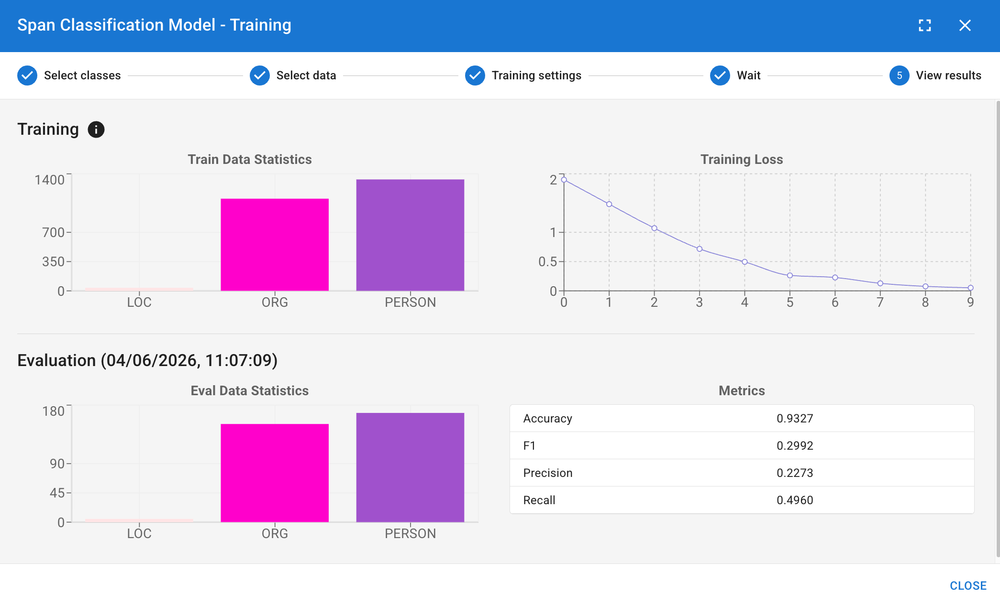

# The Classifier View

While the LLM Assistant is excellent for exploring concepts using zero-shot or few-shot prompts, qualitative research often requires highly specific, project-tailored automated coding. The **Classifier View** allows you to train your own custom Machine Learning models based entirely on your team's manual annotations.

Unlike the LLM Assistant which relies on written descriptions, a custom Classifier learns directly from the data patterns in your manual coding. Once trained, these lightweight models require no prompts, execute very quickly, and can even be exported outside of DATS!

## 1\. Accessing the Classifier View

1. Look at the main left navigation bar.
2. Click the **Classifier icon** (usually depicted as a brain or network node) or use the keyboard shortcut Ctrl+Shift+C.

This opens a split-screen dashboard:

* **Top Panel (Trained Classifiers):** A list of all models previously trained in this project, showing their name, type, targeted codes, and creation date. Here you can expand a model to view its stats, run an Evaluation, or trigger an Inference job.
* **Bottom Panel (Job Progress):** A queue displaying currently running training/inference jobs and a history of previous jobs.

*Manage your custom machine learning models and monitor training jobs from the Classifier Dashboard.*

## 2\. Training a New Classifier (TRAIN)

To build a new model, click the **Train** button. You will be guided through a four-step configuration wizard.

### Step 1: Select Type & Codes

First, decide what kind of classifier you are building:

* **Document Classifier:** Predicts structural **Tags** for whole documents.
* **Sentence Classifier:** Predicts **Codes** for discrete sentences.
* **Span Classifier:** Predicts **Codes** for arbitrary text spans.

Next, choose the specific codes/tags the model should learn:

* **Binary Classifier (1 Code):** If you select a single code, the model learns a simple "Yes/No" rule for that specific concept.
* **Multi-Label Classifier (2-10 Codes):** If you select multiple codes, the model will decide which (if any) of these codes apply.

!!! tip "Multi-Label Rule of Thumb"

    When training a multi-label classifier, the selected codes should ideally be **siblings** in your Codebook (e.g., training a model to differentiate between Emotion: Joy, Emotion: Anger, and Emotion: Sadness).

### Step 2: Select Training Data

You must tell the model which manual annotations to learn from.

1. **Select Tags:** Choose which subset of documents to use. *(Best Practice: Do not use your whole corpus. Create a "Train" tag and assign it to \~80% of your coded documents, reserving the other 20% for testing).*
2. **Select Users:** Choose whose manual annotations should be considered the "Gold Standard" for training.
3. **Review Dataset Statistics:** DATS will show you how many examples it found. **Crucial:** Ensure your classes are balanced. You ideally want roughly \~200 examples per code, with minimal variance between them.

### Step 3: Training Settings

* **Name:** Give your classifier a highly descriptive name so your team knows exactly what it does.
* **Model Selection:** Choose the underlying base model. Smaller models train faster, while larger or language-specific models might yield higher accuracy. For your first attempt, the default parameters are usually sufficient.

### Step 4: Run & View Results

Click **Start Training**. This is a computationally intensive process and may take some time depending on your dataset size. Monitor the progress in the bottom panel.

Once finished, you can view the **Training Loss** (showing how the model improved across its learning epochs) and initial **Eval Metrics** (how well it performed on the training data itself).

*Follow the 4-step wizard to configure your training data and model parameters.*

## 3\. Evaluating the Model (EVAL)

Training metrics only tell half the story. You need to know how well your model performs on data it has *never seen before*.

1. Find your newly trained model in the Top Panel list.
2. Click **EVAL**.
3. You will be prompted to select data again. This time, choose the **Test Tag** (the 20% holdout set you specifically did not use in Step 2 of training).
4. Run the evaluation. DATS will compare the model's predictions against your manual coding in the test set, providing you with rigorous Precision, Recall, and F1 scores.

## 4\. Applying the Model (INFER)

Once you are satisfied with the EVAL scores, you can unleash your custom classifier on the rest of your un-coded corpus!

1. Find your model in the Top Panel and click **INFER**.
2. A specialized Search View will open. Use the standard search bar and filters to isolate the exact documents you want the AI to analyze (e.g., filtering for documents from the year 2022 that have not been manually coded yet).
3. **Handle Overlaps:** If the selected documents already contain some manual annotations, DATS will ask how you want to handle potential conflicts (e.g., overwrite them or skip them).
4. Click **Start Inference**.

The model will rapidly scan the selected documents and apply new annotations. You can review the general statistics of this job in the bottom progress panel, and then open the actual documents to read your newly automated, custom-coded text!
