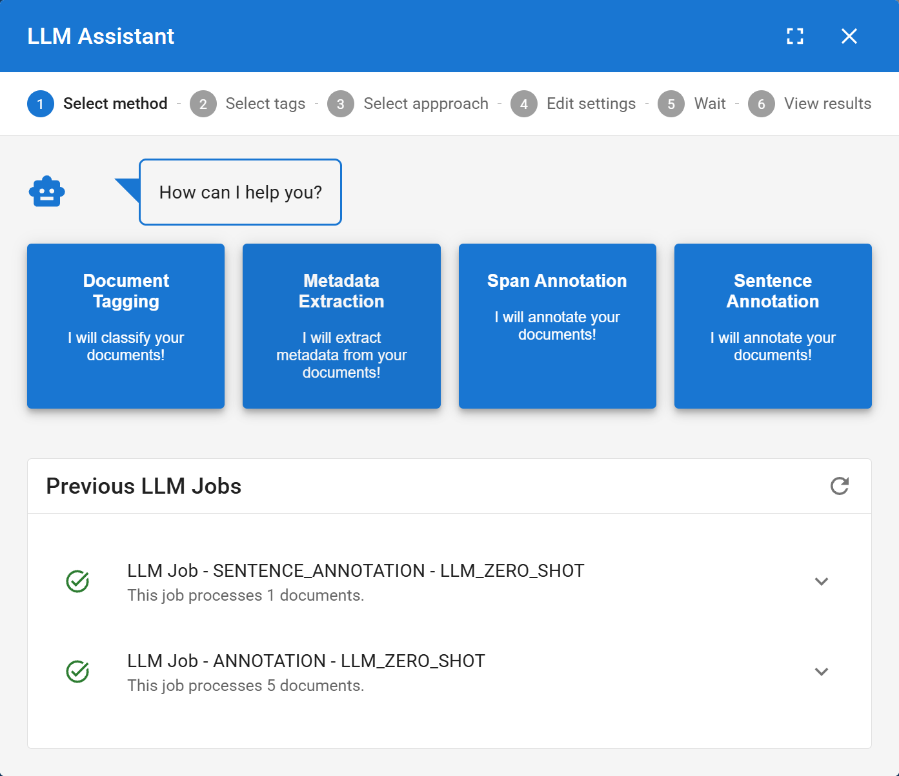
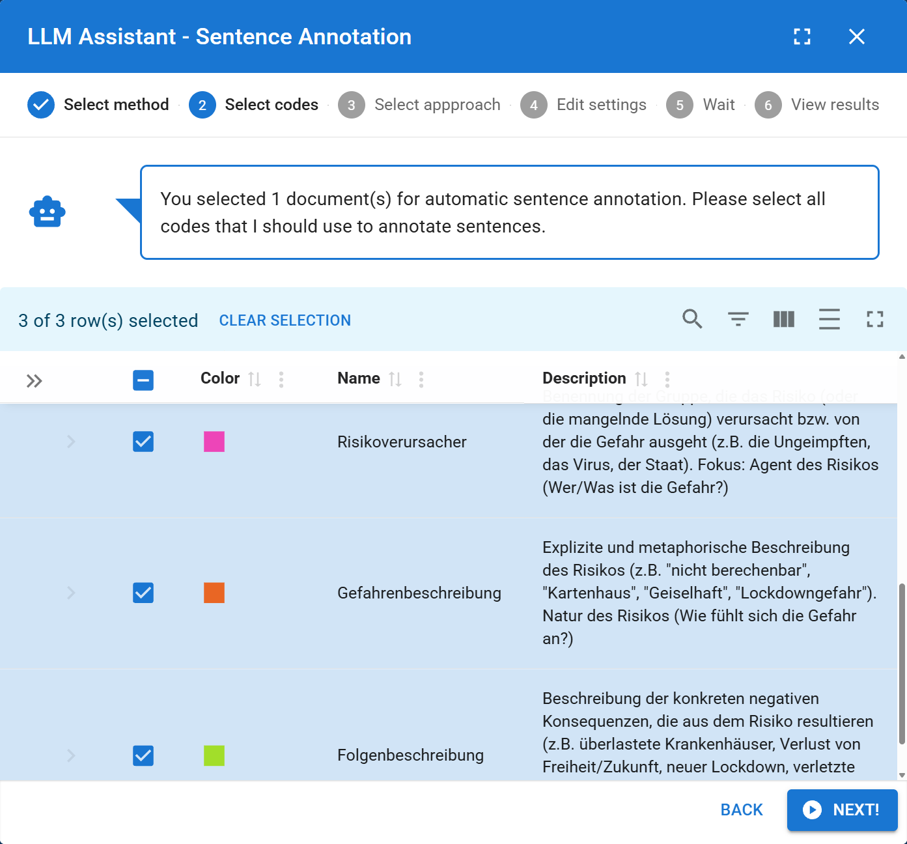
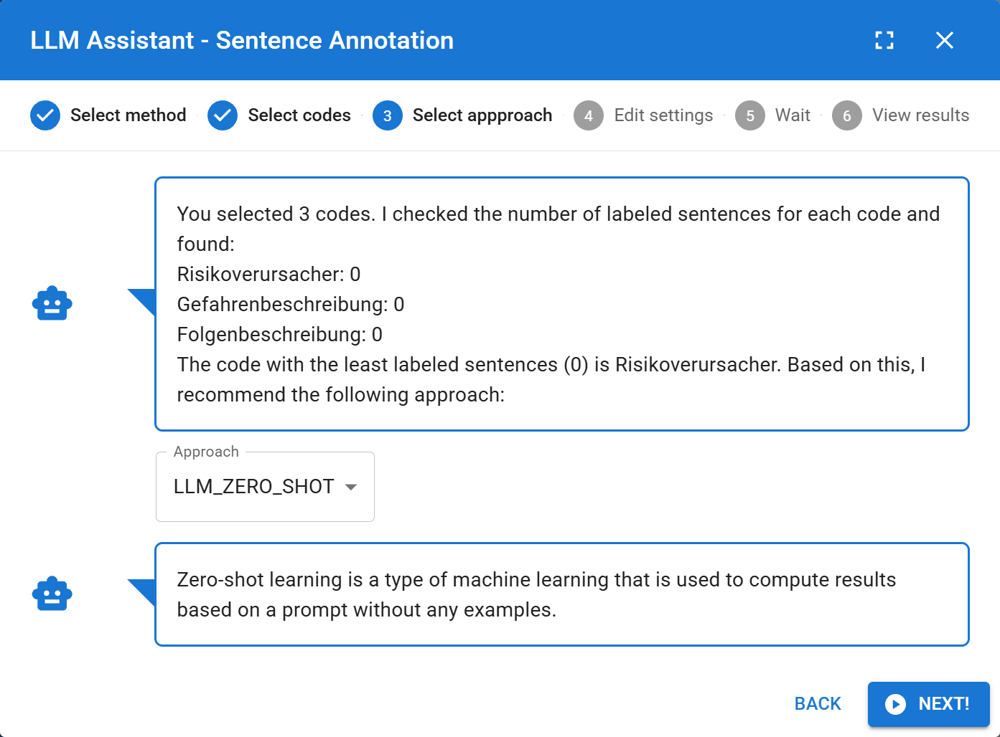
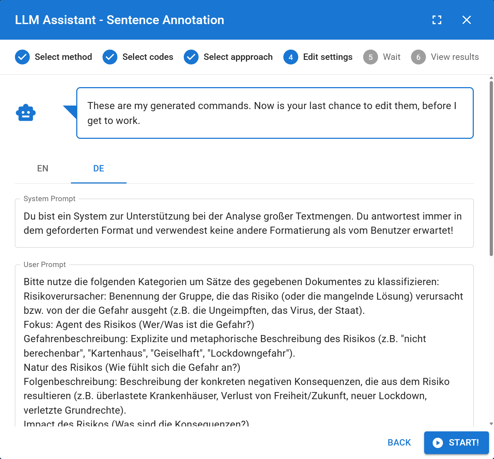
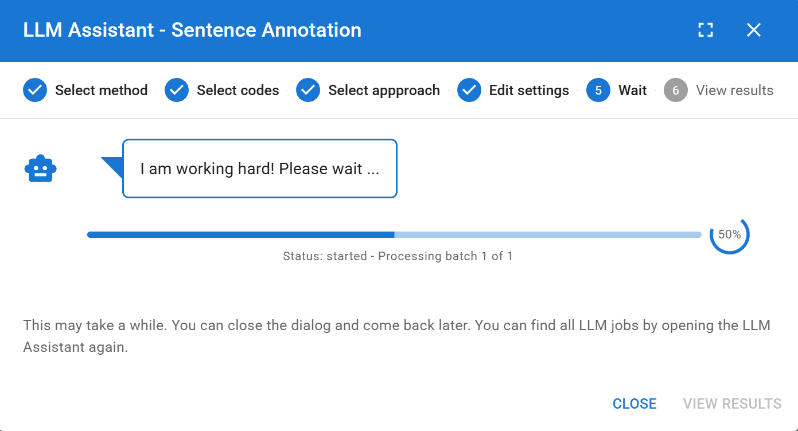
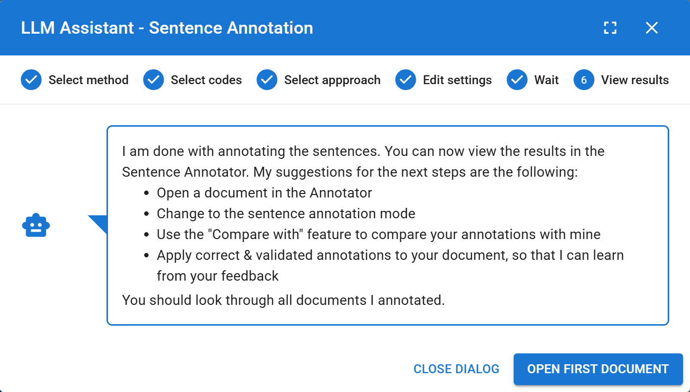
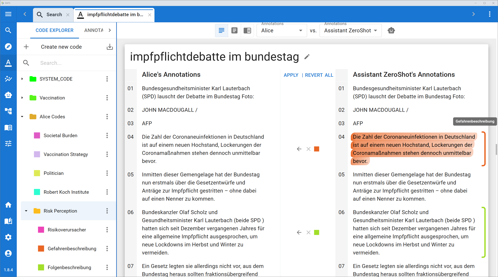

# The LLM Assistant

While manual coding is the foundation of qualitative discourse analysis, it can become incredibly time-consuming when dealing with massive datasets. To accelerate your research workflow, DATS features an integrated **LLM Assistant** that leverages state-of-the-art Large Language Models (LLMs) to automatically suggest tags, extract metadata, and generate text annotations.

Because the assistant operates strictly within DATS using secure, locally hosted models (like Gemma or Llama), your sensitive research data remains entirely private.

*(For a deeper dive into the methodology and evaluation of this AI-assisted workflow, please refer to our publications: [Exploring Large Language Models for Qualitative Data Analysis](https://aclanthology.org/2024.nlp4dh-1.41/) and [Semi-automatic Sequential Sentence Classification in the Discourse Analysis Tool Suite](https://aclanthology.org/2025.naacl-demo.16/)).*

## 1\. Accessing the Assistant

Before the AI can help you, it needs to know *which* documents to analyze. Therefore, you can access the LLM Assistant in two different ways depending on your current workflow:

### Method A: Single Document (From Annotation View)

When you are deep-reading a specific file in the **Annotation View**, you can ask the assistant to help you code that exact file.

1. Look at the top Annotation Toolbar (where you select your reading mode).
2. Click the **Robot icon**.
3. This opens the LLM Assistant Dialog to process *only* the currently open document.

### Method B: Batch Processing (From Search View)

If you want the AI to analyze dozens or hundreds of documents at once, you must initiate the job from the **Search View**.

1. Use the search bar and filters to find the documents you want to analyze.
2. Select the documents using the checkboxes in the results table. *(Tip: Use the master checkbox at the top to select all visible rows).*
3. Once at least one document is selected, the **Robot icon** will appear in the top toolbar. Click it to open the dialog for your selected batch.

## 2\. The Multi-Step Workflow

The dialog guides you through a simple, step-by-step configuration process. *(The following example assumes you chose Span Annotation).*

## 1\. Choosing a Task

*Select the specific qualitative task you want the AI to automate.*

When the dialog opens, the assistant will greet you and ask what kind of help you need. You can choose from four distinct AI tasks:

* **Document Tagging:** The AI will read the documents and suggest which structural Tags (e.g., Domain: Politics, Sentiment: Negative) should be applied to them as a whole.
* **Metadata Extraction:** The AI will scan the text to automatically populate custom metadata fields (e.g., finding the Author or Publication Date hidden in the text).
* **Span Annotation:** The AI will highlight specific words or phrases and assign them to your qualitative Codes.
* **Sentence Annotation:** The AI will classify entire, discrete sentences according to your Codebook.

### Step 2: Select Targets (Codes, Tags, or Metadata)

You must tell the AI *what* to look for.

* A list of your project's Codes (or Tags/Metadata) will appear.
* Use the checkboxes to select the specific categories you want the AI to apply.
* *Note:* The AI relies heavily on the **Descriptions** you wrote for these codes in the Project Settings. The better your written description, the more accurate the AI's predictions will be\!

### Step 3: Select Approach

Decide how much context the AI needs to do its job:

* **ZERO-SHOT:** The AI will rely *only* on the code descriptions you provided. It receives no examples. This is great for broad, obvious categories.
* **FEW-SHOT:** The AI will be provided with your code descriptions *plus* several examples of annotations you have already created manually. This usually yields much higher accuracy for nuanced, theoretical concepts.

### Step 4: Edit Settings (The Prompt)

*Review and manually tweak the AI prompt before starting the job.*

DATS automatically generates the complex instruction prompt that will be sent to the LLM.

* In this view, you can read the exact prompt (in English or German) that the AI will receive.
* You can manually edit this text to add extra instructions, refine the definitions, or correct the example sentences before execution.

### Step 5: Wait (Background Processing)

Click **Start\!** The dialog will close, and the job will run asynchronously in the background. You are free to continue reading or analyzing other documents while the AI works.

* To check the progress, simply click the Robot icon again to open the dialog and look at the **Previous LLM Jobs** list at the bottom of the welcome screen.

## 6\. Reviewing and Applying Results

Because qualitative research requires human oversight, DATS **never** applies AI annotations directly to your project without your permission.

1. Once a job is finished, open the LLM Assistant dialog and click **View Results** next to the completed job.
2. You will be presented with a review screen showing the document text with all of the AI's suggestions highlighted.
3. **Human-in-the-Loop:** You can click on any AI suggestion to modify it. You can delete an incorrect suggestion or change its assigned code.
4. Once you are satisfied with the AI's work, click **Apply Annotations\!**.

*(Note: AI-generated annotations are saved under a special ZERO/FEW-SHOT ASSISTANT user profile, ensuring they are always distinguishable from your own manual coding in the analysis views\!)*
