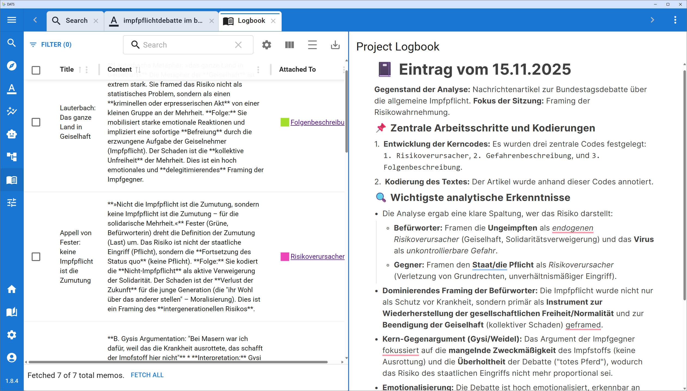

# The Logbook View

While the Search and Annotation views are focused on exploring and coding your data, the **Logbook View** is your dedicated space for reflection, synthesis, and documentation.

Discourse analysis is a highly interpretive process. Throughout your research, you will likely create dozens or hundreds of Memos (digital "post-it" notes) attached to various documents, codes, and annotations. The Logbook View acts as a centralized dashboard to review all of these scattered thoughts and weave them together into a coherent research narrative.

*The Logbook View: Your central hub for project reflection and documentation.*

## The Left Panel: The Memo Explorer

The left side of the screen houses the **Memo Explorer**. Instead of clicking through individual documents to find your notes, this panel aggregates every single memo created by anyone in your project into one searchable, filterable list.

*Use the Memo Explorer to quickly retrieve and review your interpretive notes.*

### Viewing and Editing Memos

* **The Memo List:** All your memos are displayed as a list of cards.
* **Quick Edits:** If you need to update a thought, simply hover your mouse over a memo card and click the **pencil icon** in the bottom left corner to edit its title or content directly.

### Searching and Filtering

As your project grows, finding a specific note can become challenging. Use the toolbar at the top of the Memo Explorer to narrow down the list:

* **Keyword Search:** Type in the search bar to find specific terms. *Note: This search queries the **content** of the memos, not just their titles.*
* **Filter by "Attached To":** This is an incredibly powerful feature. You can filter the list to only show memos attached to a specific type of research object. For example, you can filter to see:
  * *Only* memos attached to Documents (great for high-level summaries).
  * *Only* memos attached to specific Codes (perfect for reviewing how your definition of a concept has evolved).
  * *Only* memos attached to Annotations (useful for reviewing specific textual interpretations).

!!! tip "Team Collaboration"

    Remember that memos are visible project-wide! The Memo Explorer is an excellent way to review notes left by your colleagues, identify emerging patterns in the team's analysis, and address any methodological uncertainties that have been flagged.

## The Right Panel: The Project Logbook

While memos are meant for quick, context-specific notes, the right side of the screen is dedicated to the **Project Logbook**. This is a persistent, rich-text document that belongs to the project as a whole.

*The Project Logbook serves as a living document for your overall research progress.*

### Purpose of the Logbook

The Logbook is designed to be a flexible space for high-level documentation. While you review your specific memos on the left, you can use the Logbook on the right to:

1. **Track Progress:** Keep a chronological diary of your research steps, noting when specific case studies were completed or when the coding phase concluded.
2. **Document Methodological Decisions:** Record *why* certain codes were merged, why specific tags were created, or how you resolved disagreements in the team's coding strategy. This is vital for maintaining an audit trail and ensuring research transparency.
3. **Draft Initial Syntheses:** As you review memos on the left, use the Logbook on the right to start drafting your initial findings, hypotheses, and overarching interpretations.

!!! note "A Living Document"

    The Project Logbook is persistent and shared across your team. It auto-saves your progress and acts as the "living memory" of your discourse analysis project, making it much easier to write your final report or publication down the line.
