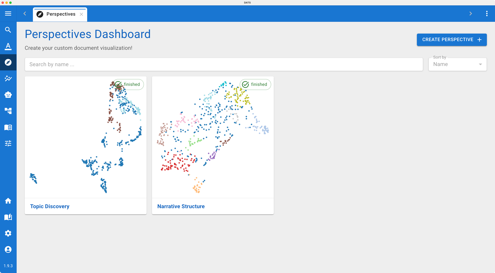
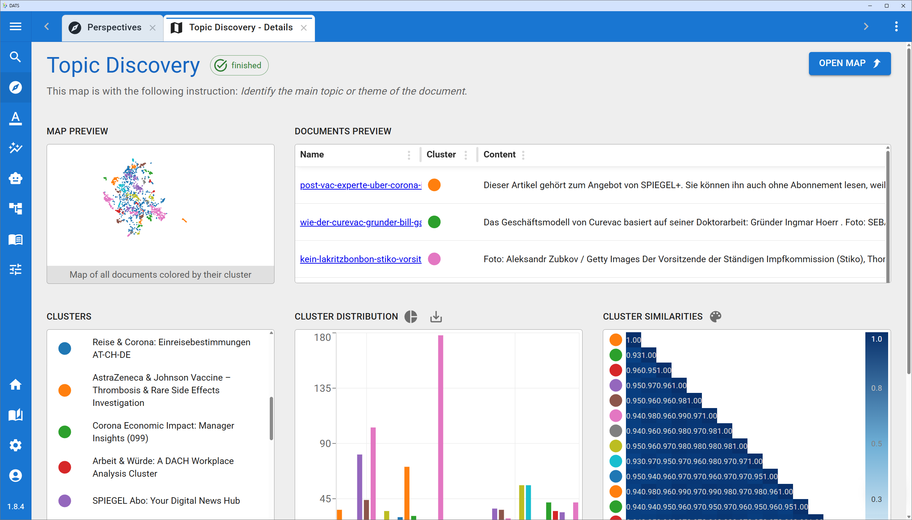
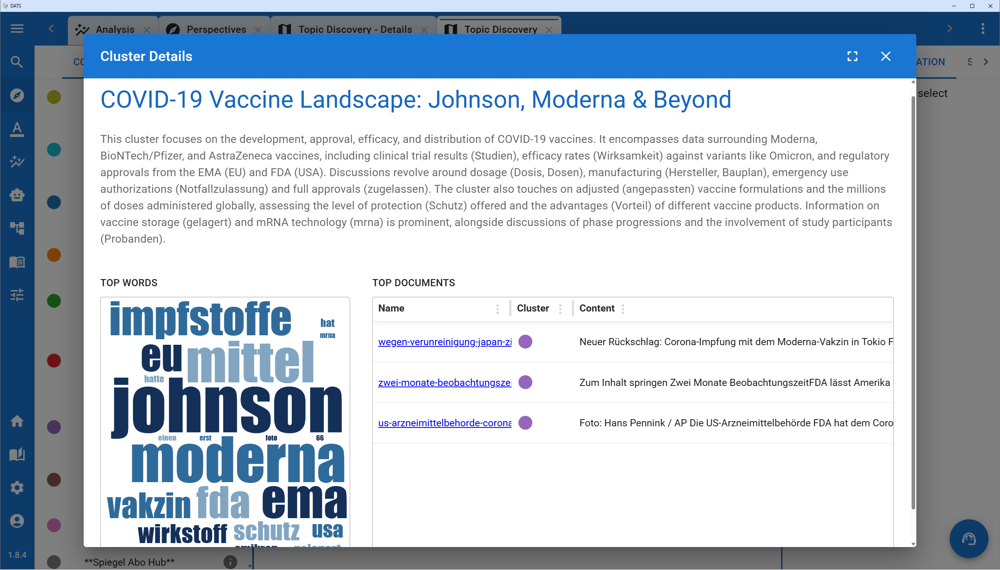
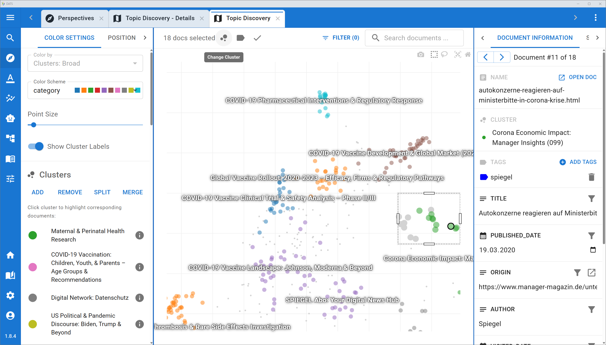

# The Perspectives View

When confronted with massive, unstructured datasets, knowing where to start your discourse analysis can be daunting. You may want to identify overarching topics, group articles by sentiment, or find thematic similarities across thousands of documents without having to read them all first.

To solve this, DATS includes the **Perspectives View**, an interactive, AI-powered document clustering extension. It generates a 2D visual map of your corpus, automatically groups similar documents together, and allows you to refine these clusters using a "human-in-the-loop" approach until they perfectly align with your research goals.

*(Read more about the design, methodology, and evaluation of this feature in our publication: [Perspectives – Interactive Document Clustering in the Discourse Analysis Tool Suite](https://arxiv.org/abs/2602.15540)).*

## 1\. The Perspectives Overview (Creating a Lens)

You can access this tool by clicking the **Perspectives icon** (the map/compass symbol 🗺️) in the main left navigation bar.

This opens the Perspectives Overview. Here, you will see a list of all Perspectives previously created by you or your team. You can open an existing one, or create a brand new one.

When you create a new Perspective, you are essentially defining the *analytical lens* through which the AI should look at your data:

1. **Select Documents:** Choose which part of your corpus you want to cluster (e.g., all documents, or only a specific subset based on Tags/Folders).
2. **Define the Instruction Prompt:** You must tell the embedding model *how* to group the documents.
   * *Example (Topic):* "Identify the main topic of the article."
   * *Example (Sentiment):* "Summarize the sentiment towards climate change."
3. **Optional Rewriting Prompt:** For highly specific lenses, you can provide an LLM rewriting prompt. This forces the system to first extract or summarize the relevant aspect of the document before clustering it, reducing noise.

Once you click start, DATS processes the documents and generates the clusters.

## 2\. The Perspective Dashboard

*Review high-level statistics and cluster summaries on the Dashboard.*

Once the processing is complete (or when you open an existing Perspective from the Overview), you are taken to the **Perspective Dashboard**.

This view provides a high-level, statistical summary of the AI's clustering results before you dive into the deep visual mapping.

* **Cluster Statistics & Plots:** View aggregated data visualizations showing the distribution of documents across the newly generated clusters.
* **The Cluster List:** A comprehensive list of all the AI-generated clusters, including their automatically assigned names.
* **Cluster Detail Dialog:** If you click on any specific cluster in the list, a detailed dialog opens. This dialog provides a deeper dive into that specific group, showing the most frequent keywords, representative documents, and dominant entities within that cluster.

*The Cluster Detail Dialog provides a deeper dive into the AI-generated groups.*

## 3\. The Interactive Map View

*Use the Map View to visually explore and manually refine the AI's clustering.*

From the Dashboard, you can launch the **Map View**. This is the core exploratory workspace where you interact with the data visually and provide your "human-in-the-loop" feedback.

The Map View is a complex, three-pane interface:

### The Central Map (Main View)

At the center is an interactive 2D scatter plot. Every dot represents a single document, colored by its assigned cluster. The closer two dots are, the more semantically similar they are based on your initial prompt. You can pan, zoom, and hover over any dot to instantly preview the document's content.

### The Left Sidebar (Refinement Tools)

AI clustering is rarely perfect on the first try. The left sidebar provides powerful tools to refine and restructure the map. Select documents or clusters on the map, then use these operations:

* **Change Cluster:** Reassign a misclassified article to the correct cluster.
* **Merge Clusters:** Combine two overly granular clusters (e.g., "Wind" and "Solar") into a broader theme ("Renewables").
* **Split Cluster:** Force the AI to break down a cluster that is too broad into more specific sub-groups.
* **Add Cluster:** Manually group selected documents into a brand-new, custom cluster.
* **Accept Assignment:** Mark a document as "Accepted" if it perfectly represents its cluster. This is crucial for the fine-tuning step.

### The Right Sidebar (Context & Statistics)

As you navigate the map and select different clusters, the right sidebar dynamically updates to provide context:

* **Details:** Displays AI-generated names, keywords, and entity statistics for the currently selected area of the map.
* **Similarity Matrix:** A visual tool showing the relationships and overlaps between different clusters.

## 4\. Fine-Tuning the Model

The true power of the Perspectives tool lies in its ability to learn from your manual refinements.

Once you have provided feedback using the left sidebar tools—by correcting misclassifications, merging groups, and accepting representative documents—you can trigger a model refinement.

DATS will take your manual adjustments and execute a rapid "few-shot fine-tuning" of the underlying embedding model. The map will then reload. Because the AI now understands your specific research intent much better, the new clusters will appear significantly more distinct, coherent, and aligned with your theoretical framework!

## 5\. Exporting to DATS (Closing the Loop)

The Perspectives View is an exploratory workspace, but its ultimate goal is to prepare your data for rigorous analysis.

Once you are fully satisfied with your thematic or sentiment-based map, you can **export your refined clusters back into your main DATS project as Tags**.

1. Click the Export button.
2. The system will convert your cluster names into structural DATS Tags and assign them to the corresponding documents.
3. You can now return to the standard **Search View**, filter your corpus by these newly discovered topics, and begin your deep-dive manual coding or Timeline Analysis!
