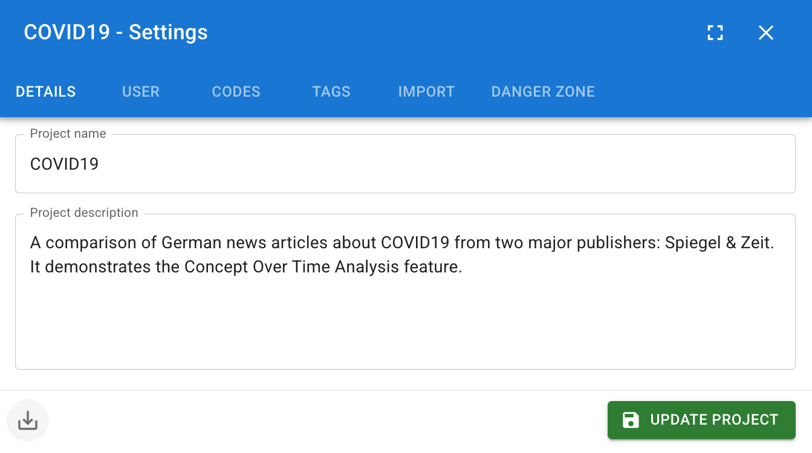
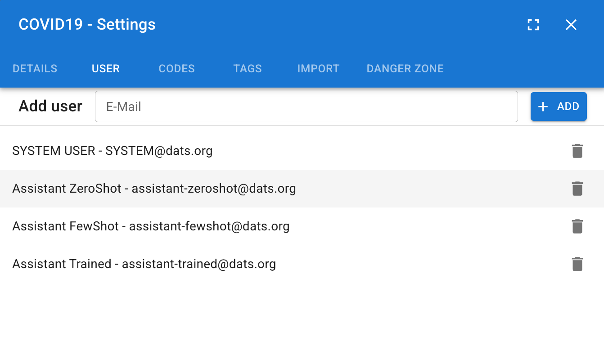
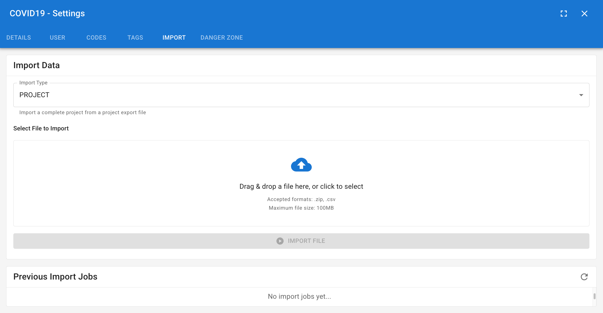
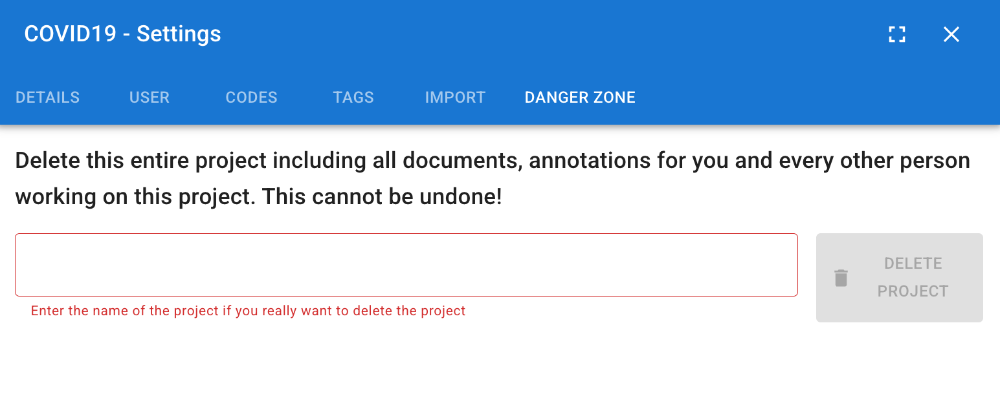

# Project Management & Settings

Effective data management is the foundation of any successful discourse analysis project. DATS is designed to handle multiple distinct research endeavors simultaneously, allowing you to create separate workspaces—called Projects—for different datasets or research teams.

This chapter covers how to create and manage your projects from the main dashboard, and how to configure global project settings once you are inside a workspace.

## 1\. The Project Dashboard (Home)

When you first log in to DATS, or whenever you click the **Home** icon (the house symbol) in the main left navigation bar, you are brought to the Project Dashboard.

*The Project Dashboard is your starting point in DATS.*

### Creating a New Project

Starting a new research endeavor is simple:

1. Click the large **"Create new project"** box on the dashboard.
2. A dialog will appear. Enter a clear **Project Name** and a brief **Description** outlining the research goals.
3. Click **Create Project**.
4. Your new project will immediately appear as a card on your dashboard.

### Accessing Existing Projects

Every project you have created, or that you have been invited to join by a colleague, is displayed as a card on this dashboard.

* **To enter a project:** Simply click anywhere on the project card. You will be instantly routed to the Search View for that specific dataset.

## 2\. Global Project Settings

Once you have entered a project, you can manage its global configuration, taxonomies, and team members.

To access these configurations, click the **Settings icon (the cog wheel)** located at the bottom left of the main navigation bar. This opens the comprehensive Project Settings dialog.

*The Project Settings dialog controls the global configuration of your current workspace.*

The Settings dialog is divided into six tabs, allowing you to manage different aspects of your project:

### Details Tab

This tab displays the basic information you provided when creating the project. You can edit the **Project Name** and **Description** here at any time.

### User Tab (Team Collaboration)

DATS is built for collaborative research. Use this tab to manage who has access to your dataset.

* **Inviting Users:** Enter the email address of a colleague in the "Add user" field and click **Add**. *(Note: The user must have already registered a DATS account using that email address before you can add them).*
* **Removing Users:** You can revoke access by finding the user in the list and clicking the remove icon.

### Codes Tab

While you can create codes on-the-fly in the Annotation View, this tab provides a global, top-down view of your entire Codebook.

* **Taxonomy Management:** View your complete hierarchical code structure.
* **Global Hiding (The Eye Icon):** Clicking the eye icon next to a code globally hides that code and all its annotations from the document viewer. This is incredibly useful if you want to temporarily hide the automatically generated SYSTEM\_CODES to focus solely on your manual coding.
* **Global Disabling (The Toggle Icon):** Disabling a code prevents anyone in the project from applying it to new annotations, effectively retiring it from active use while preserving existing data.

### Tags Tab

Similar to the Codes tab, this section provides a global overview of your structural Tag taxonomy.

* You can create new top-level tags, build hierarchical structures, and edit the names or colors of existing tags here. *Note: You apply these tags to specific documents in the Search View.*

### Import Tab

If you have previously exported a DATS project (e.g., as a backup), you can use this tab to upload the exported file and restore the data into your current project environment.

### Danger Zone Tab

As the name implies, this tab contains destructive actions.

* **Delete Project:** Click the red "Delete" button to permanently erase the project.
* **Warning:** This operation is final and irreversible. All documents, annotations, codes, tags, memos, and the logbook associated with this project will be permanently destroyed.
