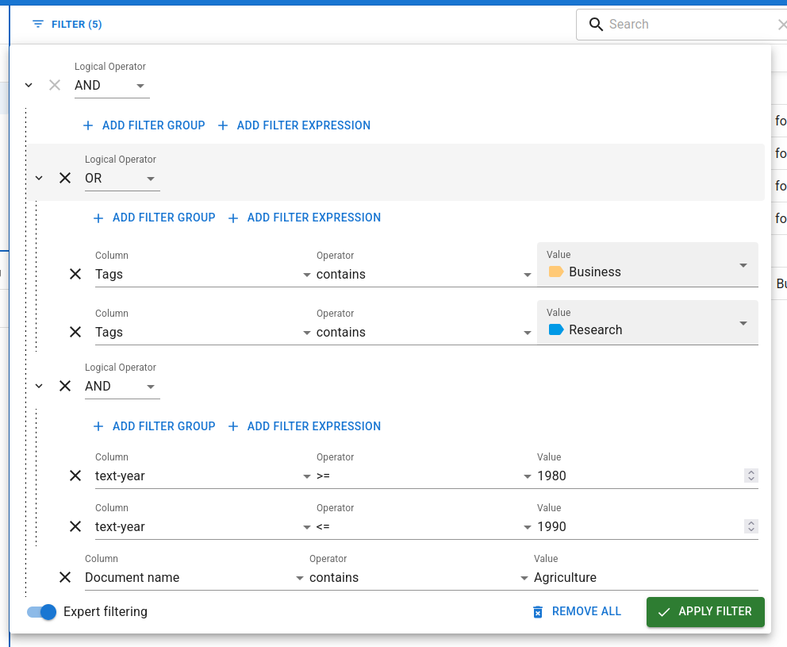
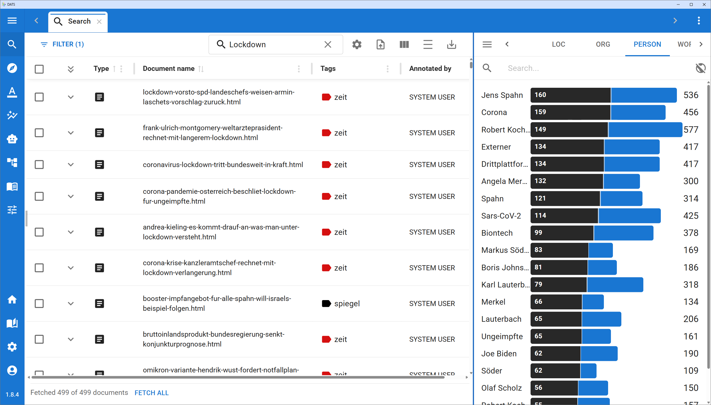

# 5.1 The Search View

The Search View is the primary hub for exploring your dataset, managing your corpus, and finding the specific documents you want to analyze. It is the default view you see when opening a project and acts as the gateway to the rest of the DATS tools.

*The Search View provides a comprehensive overview of your corpus.*

## The Central Workspace: Searching and Filtering

At the center of the Search View is your main workspace, consisting of the Search Bar, the Filter menu, and the Results Table.

### The Search Bar

The search bar at the top allows you to perform keyword searches across your entire corpus.

* **Content Search:** By default, this searches the *content* of the documents (the actual text), not the titles or metadata.
* **Contextual Results:** When a search term is found, you can click the small arrow next to a document in the results table to expand it. DATS will display a text snippet highlighting exactly where your search term appears in context.

### Advanced Filtering

For more complex queries, click the **Filter** button to the left of the search bar.

* **Filter Expressions:** You can filter by specific metadata (e.g., Author contains Smith, or Year \>= 2020).
* **Expert Filtering:** Toggle "Expert filtering" on to use logical operators (AND, OR). This allows you to stack multiple conditions (e.g., Tag contains Business AND Year \>= 2015).
* *Note: Metadata text filters are case-sensitive.*

### The Results Table

The central table displays the documents that match your current search and filter criteria.

* **Files vs. Documents:** To handle massive datasets, DATS automatically splits very long files (like a 300-page PDF) into smaller 10-page "Documents". In the table, these are grouped together inside **File-Folders**.
* **Customizing the Table:** Click the **Show/hide columns** icon to choose which metadata fields (Author, Date, Journal, etc.) are visible. You can sort the results by clicking on any column header.
* **Density Toggle:** If your table feels cluttered, use the **Toggle density** button (the \= icon) to compress the rows and see more documents at once.
* **Opening Documents:** **Double-click** any document to open it in a new tab (the Annotation View). You can also select multiple documents using the checkboxes and click **Open in tabs** in the top toolbar.

## Left Sidebar: Organizing Your Corpus

The left side of the Search View is dedicated to organizing your documents into logical groups using Folders and Tags.

*The Folder and Tag Explorers.*

### The Folder Explorer

While File-Folders group split pages of a single document, **Project-Folders** allow you to group distinct files together—perfect for defining Case Studies or specific sub-corpora.

* **Creating Folders:** You can create hierarchical folders (folders within folders).
* **Assigning Documents:** Select documents in the central table, then click the **Folders** button that appears in the top toolbar to assign them to a specific Project-Folder.
* *Note: Folders are mutually exclusive; a document can only belong to one Project-Folder.*

### The Tag Explorer

Tags act as colorful labels that you can apply to documents. Unlike folders, a single document can have multiple tags (e.g., Domain: Politics, Media: News, Language: EN).

* **Managing Tags:** Use this panel to create new tags, edit existing ones, or delete them. Tags can also be structured hierarchically.
* **Filtering by Tag:** Clicking on a tag in the explorer instantly applies it as a filter, showing only documents with that tag in the central table.

## Right Sidebar: Statistics & Metadata

The right sidebar is dynamic. Its content changes completely depending on whether you have a document selected in the central table or not.

### Mode 1: Corpus Statistics (Nothing Selected)

When no specific document is clicked, the right sidebar acts as a powerful analytical tool for the *currently fetched search results*.

*The statistics panel helps you refine your search.*

It contains three views (switchable via the icon next to the view name):

* **Keywords:** Displays automatically extracted keywords from the current results.
* **Tags:** Displays which tags are most prevalent in your current results.
* **Codes:** Displays the most frequent annotation codes present in the results.
* **Blue vs. Black Bars:** Next to each item are two bars. The blue bar shows how many documents in the *entire project* contain this item. The black bar shows how many documents *in your current search results* contain it.
  \!\!\! tip "Instant Filtering"
  Clicking on any Keyword, Tag, or Code in this statistics panel will instantly add it as a filter expression to your search\!

### Mode 2: Document Details (Document Selected)

When you click once on a File-Folder or Document in the central table, the right sidebar switches to display specific details for that item.

*The document details panel.*

It is divided into four tabs:

1. **INFO (Metadata):** View and edit the metadata for the document (e.g., Author, Date, Title, URL). You can click the "Add" button at the bottom to create custom Key-Value pairs. *Note: Editing metadata on a File-Folder applies the changes to all documents inside it.*
2. **TAGS:** View which tags are currently applied to this document. You can easily add or remove tags here.
3. **RELATED:** If the document is part of a larger split file, this tab shows all other documents belonging to the same original file, allowing you to easily navigate to the next or previous section.
4. **MEMOS:** View, create, edit, or delete post-it style notes attached to this specific document. Memos are visible to your whole team and can include rich text formatting.
