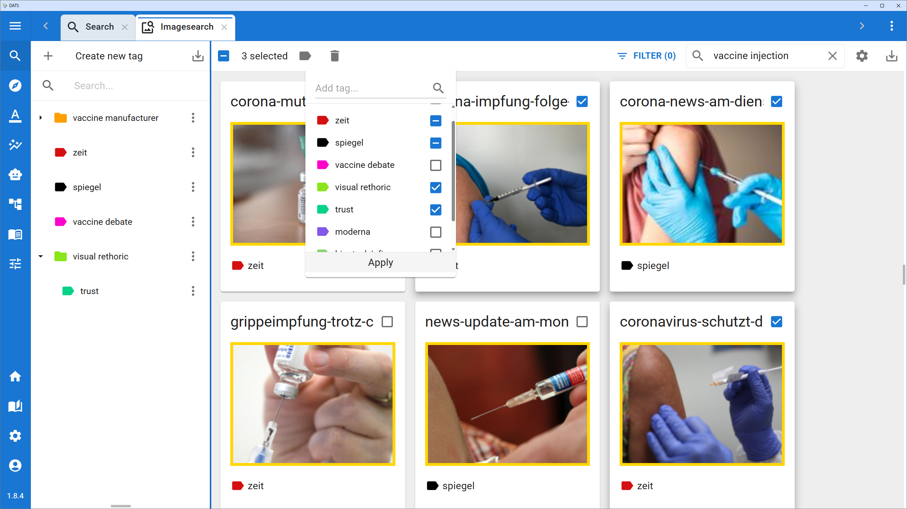

# Semantic Search View

While standard keyword search is great for finding exact matches, human language is complex. Different people use different words to describe the same concept. The **Semantic Search View** bridges this gap by allowing you to search your entire document corpus by *meaning* rather than exact phrasing.

Powered by the embeddings generated during the DATS preprocessing pipeline, this view lets you use natural language queries to uncover hidden themes, subtle references, and conceptually similar passages that traditional lexical searches would miss.

## Accessing Semantic Search

You can access Semantic Search from the main left navigation bar by clicking the **Magnifying Glass icon** and selecting either **Sentencee Search** or **Image Search** (if your project contains images). This opens the Semantic Search interface, where you can start formulating your queries and exploring the results.

## How Semantic Search Works

Behind the scenes, DATS uses advanced language models to convert both your documents and your search queries into high-dimensional numerical vectors (embeddings). When you run a semantic search, the system calculates the mathematical distance between your query's vector and the vectors of the texts in your project.

The closer the vectors, the higher the semantic similarity. This means a search for *"financial difficulties"* will successfully return documents mentioning *"struggling to pay bills"* or *"economic hardship,"* even if the words "financial" or "difficulties" never appear in the text.

## Using the Semantic Search Interface

The interface is designed for rapid querying and review, consisting of three main components:

### 1. The Query Bar & Threshold Settings
*   **Natural Language Query:** Type your search exactly as you would speak it (e.g., *"How do users feel about the new interface?"* or *"Instances of climate anxiety"*).
*   **Similarity Threshold:** A slider that allows you to control how strict the match should be.
    *   **High Threshold (e.g., 0.85+):** Returns only highly relevant, conceptually identical matches.
    *   **Low Threshold (e.g., 0.50+):** Casts a wider net, returning looser conceptual associations (useful for exploratory analysis).

### 2. The Results List
The main panel displays your search results ranked by their **Similarity Score** (highest to lowest).
*   **Context Snippets:** Each result shows the matching sentence or paragraph with its surrounding context.
*   **Score Indicator:** A visual indicator of how closely the text conceptually aligns with your query.

### 3. The Action Panel (Bulk Tagging)
Semantic Search is tightly integrated with the core DATS tagging system. Once you have generated a list of highly relevant results, you can:
*   **Select/Deselect:** Manually check or uncheck individual results in the list.
*   **Apply Tags:** Choose an existing tag from your codebook (or create a new one) and apply it to all selected results simultaneously. This is an incredibly fast way to build up annotations for a specific theme across thousands of documents.

## Workflow Example: Concept Discovery

1.  **Formulate a Concept:** You are looking for mentions of "work-life balance."
2.  **Run the Query:** You type *"Struggling to separate personal time from job responsibilities"* into the Semantic Search bar.
3.  **Adjust Threshold:** You set the similarity threshold to `0.75` to filter out irrelevant noise.
4.  **Review Results:** The system returns passages mentioning *"answering emails at midnight,"* *"no time for family,"* and *"burnout."*
5.  **Tag:** You select the relevant hits, apply the `Theme: Work-Life Balance` tag, and instantly annotate multiple documents without reading them manually top-to-bottom.
