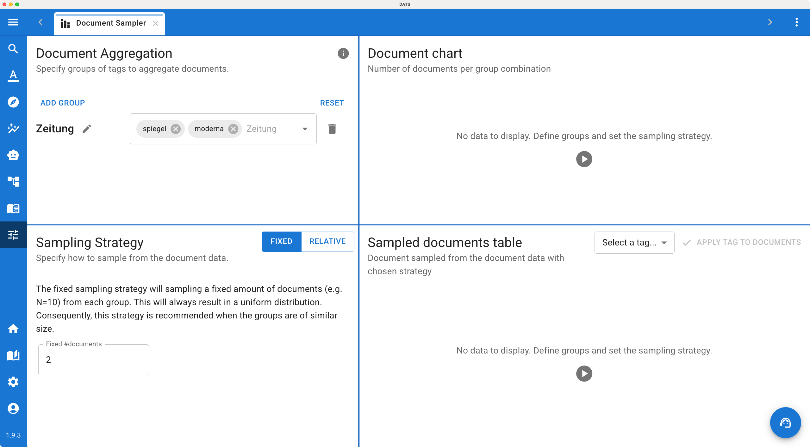

# The Document Sampler

When working with massive datasets (e.g., hundreds of thousands of scraped news articles), it is often impossible to manually annotate the entire corpus. In these cases, researchers need to draw a representative subset of documents for manual coding.

The **Document Sampler** is a dedicated utility that automates this process, ensuring that your sample is statistically sound and accurately reflects the structure of your original corpus based on the parameters you define.

## 1\. Accessing the Sampler

Like the other data preparation utilities, the Document Sampler is tucked away in the main menu:

1. Navigate to the main left navigation bar.
2. Click on the **Tools** dropdown menu (the toolbox icon 🧰).
3. Select **Document Sampler**.

*The Document Sampler uses a 4-panel interface to build and verify your document subsets.*

## 2\. Defining the Sample (Left Panels)

The left side of the interface is where you configure exactly *how* DATS should construct your subset.

### Step 1: Document Aggregation (Top Left)

Before you can draw a sample, you must tell DATS how to group your data. You do this by selecting specific structural **Tags** that already exist in your project.

* *Example:* If you want to ensure your sample represents different media types equally, you might select your Domain: News, Domain: Blog, and Domain: Forum tags to create those aggregation groups.

### Step 2: Sampling Strategy (Bottom Left)

Next, you must decide how DATS should pull documents from those groups. You have two main strategies:

* **Fixed Sampling:** You specify a strict number (e.g., N \= 10). DATS will randomly pull exactly 10 documents from *every single group*.
  * *Best Use Case:* This forces a perfectly uniform distribution. It is highly recommended when your original groups are roughly the same size, or when you are trying to balance classes for machine learning training.
* **Relative Sampling:** You specify a percentage (e.g., 10%). DATS will pull that percentage of documents from each group.
  * *Best Use Case:* If your original dataset is heavily skewed (e.g., 90% of your articles are from Domain: News and 10% are from Domain: Blog), a relative sample will maintain that exact skewed distribution in the final subset. This is crucial when you want your sample to accurately reflect the real-world occurrence rates of your data.

Once you have defined your aggregation and strategy, the system automatically calculates the results.

## 3\. Reviewing and Applying the Sample (Right Panels)

Before you commit to a sample, DATS allows you to visually and manually verify the results on the right side of the screen.

### The Document Chart (Top Right)

This dynamic chart visualizes the results of your sampling strategy. It displays a bar chart comparing the total number of documents available in each group combination versus the exact number of documents DATS has selected for the sample. This provides an instant visual check to ensure your distribution looks correct based on your chosen strategy.

### The Sampled Documents Table (Bottom Right)

Below the chart is a table listing the specific, individual documents that DATS randomly selected for the sample. You can scroll through this list to verify that the system pulled the correct types of files.

### Applying the Tag (The Final Step)

Once you are satisfied with the charts and the table, you need to save the sample back to your project. DATS does this by applying a specific tag to the selected documents.

1. Look at the bottom of the right-hand panel.
2. Select an existing tag from the dropdown menu (e.g., a tag you created called Sample\_Set\_A or Training\_Data).
3. Click the **Apply tag to documents** button.

The selected documents are now officially tagged. You can return to the main **Search View**, filter by your new sample tag, and begin your focused manual annotation!
