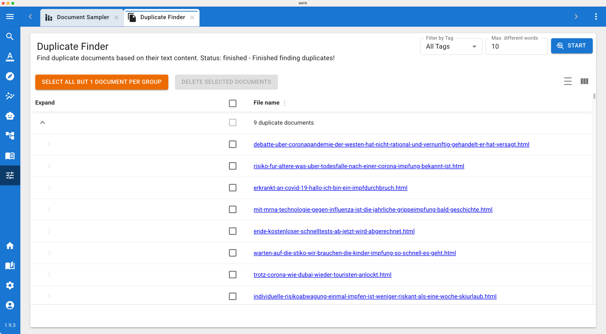

# The Duplicate Finder

When building large research datasets—especially if you are combining multiple archives, collaborating with different team members, or using the automated web scraper—you will inevitably end up with duplicate documents in your corpus.

Duplicate documents can skew your quantitative analyses (like Word or Code Frequencies) and waste your time during manual annotation. The **Duplicate Finder** is a dedicated utility designed to quickly identify and clean up these redundant files.

## 1\. Accessing the Tool

You can find this utility tucked away in the Tools menu, as it is generally used during the initial data preparation phase rather than the active analysis phase.

1. Navigate to the main left navigation bar.
2. Click on the **Tools** dropdown menu (the toolbox icon 🧰).
3. Select **Duplicate Finder**.

*Use the Duplicate Finder to keep your corpus clean and prevent skewed analysis results.*

## 2\. Configuring the Search

At the top of the Duplicate Finder view, you have a configuration toolbar with two simple parameters to define exactly what counts as a "duplicate" in your project:

* **Filter by Tag:** By default, the tool will check your entire corpus. However, if you only want to look for duplicates within a specific subset of data (e.g., checking only the documents you uploaded today), you can specify a Tag here. The tool will then ignore any documents that do not have that tag.
* **Max Different Words:** This is the core logic of the finder. Because web pages often have slightly different headers, footers, or ad text depending on when they were scraped, exact 1-to-1 matching is often too strict.
  * The default setting is **10**. This means if two documents share the same text but differ by 10 words or fewer, DATS will flag them as duplicates. You can increase or decrease this threshold based on how strict you want the matching to be.

Once configured, click the **Start** button. Depending on the size of your corpus, the tool will take a few moments to compare the texts.

## 3\. Managing and Deleting Duplicates

When the search is complete, the main area of the screen will populate with a table of results.

### Understanding the Groups

The results are not just a flat list; they are organized into **Groups**. Every group contains at least two documents (or more, if the exact same article was uploaded three or four times). All documents within a single group are considered duplicates of each other based on your chosen threshold.

### The Cleanup Workflow

You now have to decide which documents to keep and which to delete. You can do this manually by reading the document names and checking the boxes next to the ones you want to discard.

However, DATS provides a streamlined "one-click" workflow to make this process much faster:

1. Look at the top of the results table.
2. Click the **Select all but 1 document per group** button.
3. DATS will automatically check the boxes for all redundant files, leaving exactly one "original" document unchecked in every single group.
4. Review the selections briefly to ensure you are happy with them.
5. Click the **Delete selected documents** button.

The redundant files will be permanently removed from your project, leaving you with a perfectly clean corpus ready for rigorous discourse analysis\!
