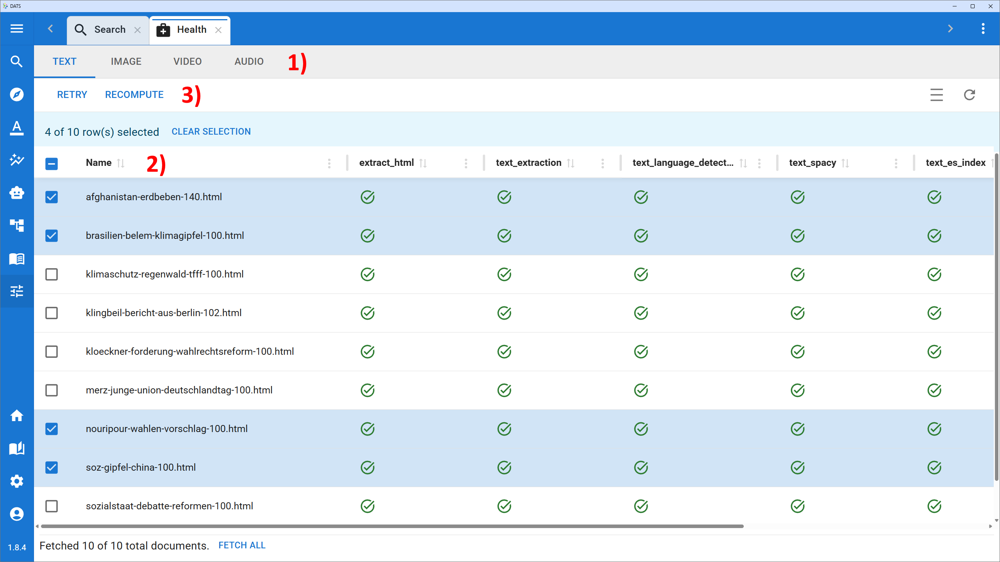

# Document Health View

When you upload documents or URLs into DATS, they run through a complex, multi-modal machine-learning pipeline. While this process is highly automated and robust, occasional hiccups can happen—a PDF might be corrupted, a website might block the scraper, or a language detection model might fail on a highly unusual text.

The **Document Health View** provides complete transparency into this preprocessing pipeline, allowing you to monitor the status of every single file in your corpus and fix any errors that occur.

## 1\. Accessing the Health View

You do not need to wait in the Import Dialog to see if your documents processed successfully. You can check on them at any time.

1. Navigate to the main left navigation bar.
2. Click on the **Tools** dropdown menu (the toolbox icon 🧰).
3. Select **Document Health**.

*The Document Health View gives you a granular look at the preprocessing status of your corpus.*

## 2\. Navigating the Status Table

Because different types of data go through completely different processing steps (e.g., audio is transcribed, while images undergo object detection), the Health View separates your documents by modality.

### Modality Tabs

At the very top of the view, you will see tabs for **Text**, **Image**, **Video**, and **Audio**. Click on a tab to view the documents of that specific type.

### Reading the Table

Below the tabs is the main status table.

* **Document Name:** The first column lists the names of the documents or split file chunks.
* **Pipeline Steps:** The remaining columns represent the specific chronological steps of the preprocessing pipeline for that modality. For example, under the **Text** tab, you might see columns like extract\_html, text\_extraction, text\_language\_detect, text\_spacy (Named Entity Recognition), and text\_es\_index (Elasticsearch indexing).
* **Status Icons:** Inside each cell is an icon indicating the status of that specific step for that document (e.g., a green checkmark for success, a spinning wheel for in-progress, or a red warning icon for failure).

## 3\. Fixing Errors: Retry vs. Recompute

If you notice that a document has failed a preprocessing step, you can easily select it using the checkbox on the left side of the row. Once one or more documents are selected, two action buttons will appear at the top of the table: **Retry** and **Recompute**.

It is important to understand the difference between these two functions:

### 🔄 Retry (The Quick Fix)

Use **Retry** when a step has explicitly failed (shows an error icon).

* Clicking **Retry** tells DATS to automatically look at the selected documents, identify exactly which steps failed, and attempt to run them again.
* *Use Case:* A temporary server timeout caused the language detection to fail. Clicking Retry will simply try the language detection again.

### ⚙️ Recompute (The Force Run)

Use **Recompute** when you want to force DATS to re-run a step that has *already succeeded*, or if you want to manually trigger a specific part of the pipeline.

* Clicking **Recompute** opens a small dropdown menu allowing you to select a *specific* pipeline step (e.g., text\_spacy). DATS will then force-run that step (and all subsequent dependent steps) for the selected documents, even if they had previously completed successfully.
* *Use Case:* You have updated the global project settings or you want to force the system to re-evaluate the named entities in a document.

\!\!\! tip "Selecting Multiple Documents"

If you had a large upload batch with multiple failures, use the master checkbox at the very top left of the table header to select all visible documents at once, then hit **Retry** to process the queue in bulk\!
