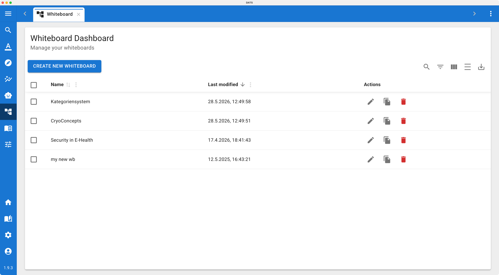
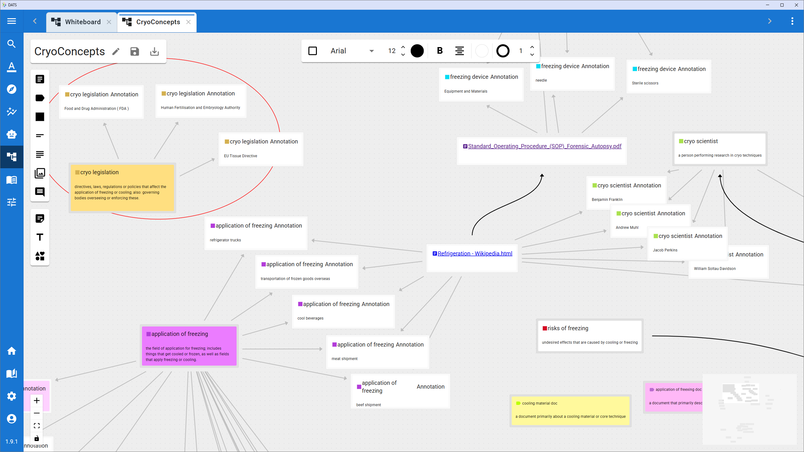
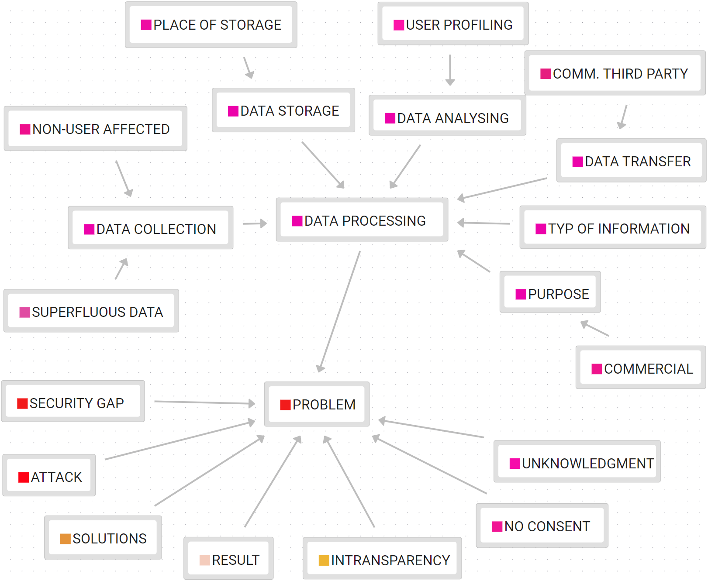
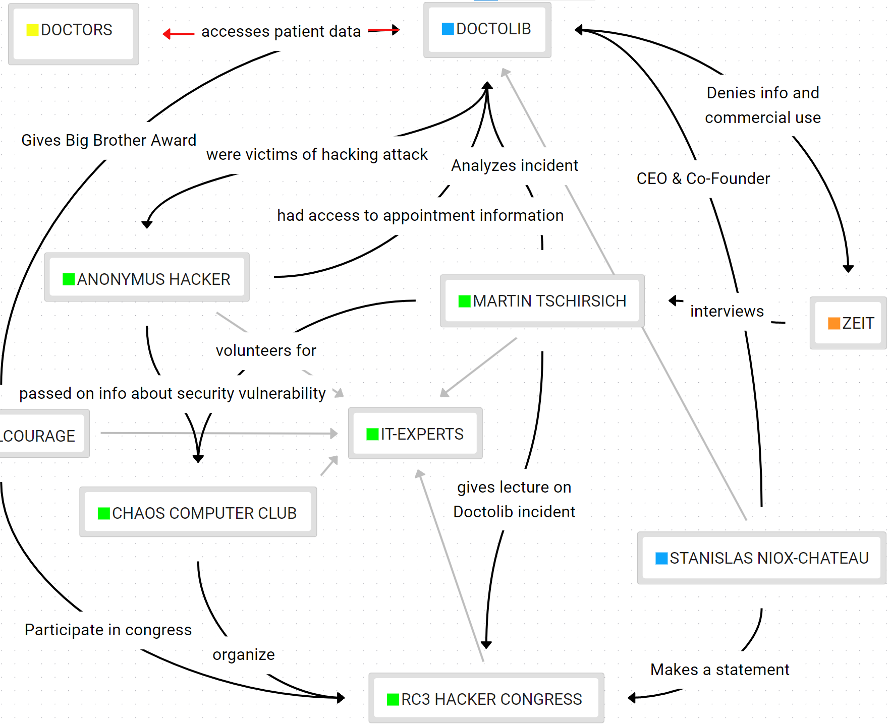
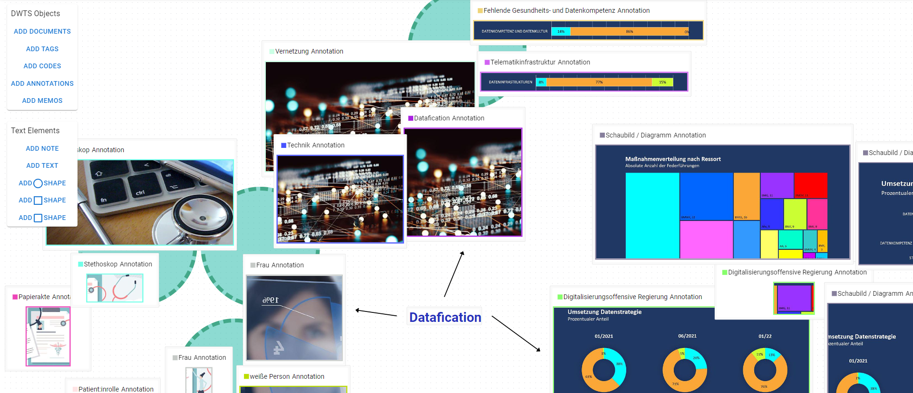

# The Whiteboard View

Discourse analysis is rarely a linear process. As you read documents, create annotations, and run analyses, you need a space to synthesize your findings, map out complex relationships, and build theoretical models.

To support this hermeneutic phase of interpretation, DATS includes the **Whiteboard View**—a flexible, infinite 2D canvas that behaves similarly to tools like Miro or FigJam, but is deeply integrated with your actual research data.

*(Read more about the design and application of this feature in our publication: [Extending the Discourse Analysis Tool Suite with Whiteboards for Visual Qualitative Analysis](https://aclanthology.org/2024.lrec-main.615/)).*

## 1\. The Whiteboard Dashboard

*Manage your visual workspaces from the Whiteboard Dashboard.*

You can access the Whiteboard feature by clicking the **Whiteboard icon** (the framed picture symbol 🖼️) in the main left navigation bar.

This opens the Whiteboard Dashboard, which manages all the canvases created within your current project.

* **Manage Canvases:** Here you can see a grid of all existing whiteboards. You can rename, duplicate, or delete them.
* **Create New:** Click the **Create new whiteboard** button to generate a fresh, blank canvas for a new brainstorming session or mapping task.
* **Open:** Double-click any whiteboard card to open it in a new tab in your top tab bar.

## 2\. The Canvas and Basic Tools

*Use standard diagramming tools to map out your initial thoughts.*

When you open a whiteboard, you are presented with a limitless grid. The interface is designed to be highly intuitive for anyone who has used digital drawing or diagramming tools.

* **Navigation:** Click and drag on the empty background to pan around the canvas. Use your mouse wheel or trackpad to zoom in and out.
* **The Toolbar:** Located on the screen, the toolbar provides standard diagramming elements:
  * **Text & Post-its:** Add standalone text blocks or colorful sticky notes to write down hypotheses or section headers.
  * **Shapes:** Draw rectangles, circles, and custom polygons.
  * **Connections:** Draw arrows and lines to link different objects together, representing relationships, flows, or conflicts.

## 3\. Integrating DATS Entities

What makes the DATS Whiteboard much more powerful than a standard drawing tool is its deep integration with your corpus. You are not just drawing abstract boxes; you are interacting with your actual data.

You can easily drag and drop (or import) your project's specific research objects directly onto the canvas as interactive nodes:

* **Documents:** Place specific news articles or images onto the board to represent key case studies.
* **Codes & Code Trees:** Import codes from your taxonomy. You can use the whiteboard to visually reorganize your code tree—moving child codes around or grouping them conceptually before making changes in the official settings.
* **Annotations:** Pull specific highlighted text snippets directly onto the canvas. This is incredible for grouping quotes that support a specific theoretical argument.
* **Tags:** Add tag nodes to visually group related documents.

**Interactive Nodes:** When you place a DATS entity (like a Document or a Code) on the whiteboard, it isn't just a static picture. You can usually interact with it—for example, double-clicking a document node on the whiteboard can open that document for reading\!

## 4\. Typical Use Cases for Discourse Analysis

Because the canvas is entirely free-form, you can use it however it best suits your methodology. Some common uses include:

1. **Code Taxonomy Mapping:** Visually planning out a complex, hierarchical codebook before applying it to the text.
2. **Actor-Network Maps:** Placing entities (Organizations, Politicians) on the board and drawing arrows between them to map out who is influencing whom in a specific debate.
3. **Narrative Timelines:** Creating a custom, visual timeline of key events by placing specific document nodes in chronological order and surrounding them with interpretive post-it notes.
4. **Sampling Maps:** Visually separating your corpus into "Train" and "Test" groups for machine learning, or defining specific sub-corpora for comparative case studies.

*Use the whiteboard to visually plan out your code taxonomy before applying it to the text.*

*Use the whiteboard to map out complex relationships between actors in your corpus.*

*The whiteboard can also be used to visually organize non-textual data, like images or videos.*
