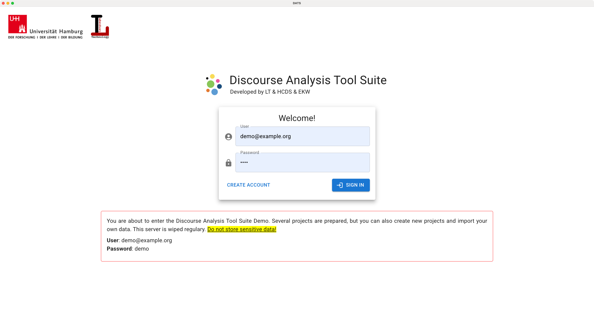
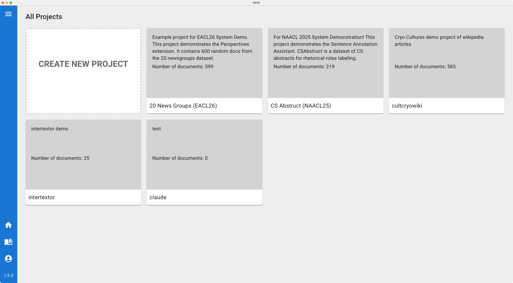
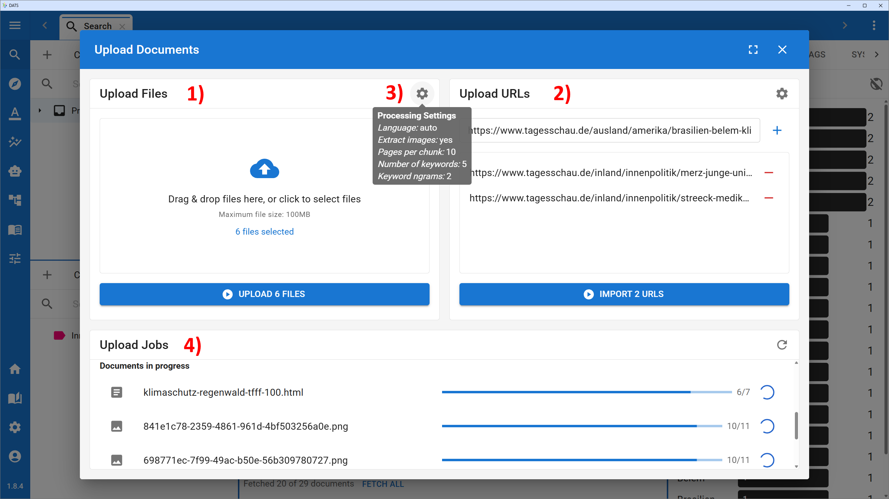
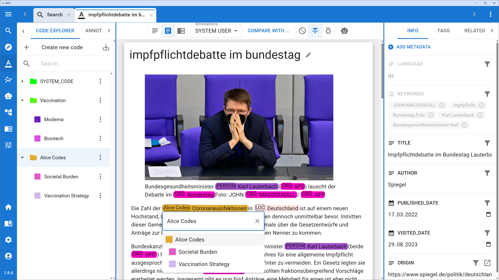
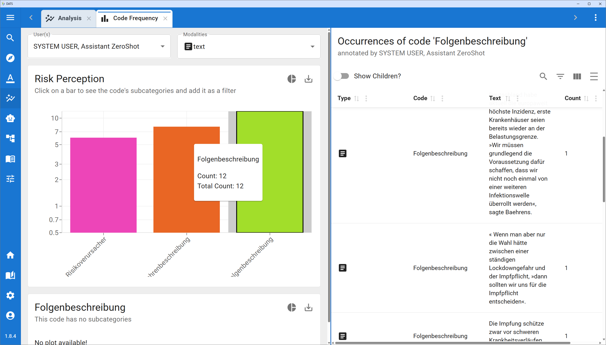

# Getting Started

Welcome to DATS! The best way to understand how the Discourse Analysis Tool Suite can support your research is to jump in and try it out.

Because DATS is a server-based web application, you do not need to install any software on your computer to use it. All you need is a modern web browser.

## Accessing DATS

**Try the Demo:**

If you are new to DATS and want to explore its features, we highly recommend using our public demo environment:

👉 [**DATS Demo Instance**](https://dats.ltdemos.informatik.uni-hamburg.de/)

**Productive Research Instances:**

The demo instance is for exploration and testing only. If you are ready to use DATS for a real, productive research project, we can provide a dedicated, secure production instance for your team. Please get in touch with us (or the House of Computing and Data Science \- HCDS) to request access for your research institute.

<iframe src='https://lecture2go.uni-hamburg.de/o/iframe/?obj=73453'  title='Video: Let&#39;s get started with DATS - Discourse Analysis Tool Suite' frameborder='0' width='647' height='373' allowfullscreen></iframe>

## Registration & Login

Before you can start analyzing data, you need to create a user account.

1. Open the DATS login screen (e.g., via the Demo Instance link above).
2. Click **Create Account** in the bottom left corner.
3. Fill out the registration form. _Note: Ensure you use a strong password (8 or more characters, containing a mix of letters, numbers, and symbols)._
4. Click **Register** to finish. You will be redirected back to the login screen.
5. Log in using your newly created email and password.

## The 5-Minute Quick Start Walkthrough

This brief walkthrough will guide you through the essential DATS workflow: setting up a workspace, uploading some data, making your first annotation, and viewing the analytical results.

### Step 1: Create a Project

Everything in DATS happens inside a Project.

1. In the top navigation bar, click the **Hamburger Menu** (three horizontal lines) in the top left corner.
2. Select **Projects** to open the Project Management overview.
3. Click the large **Create new project** box.
4. Give your project a name and a brief description, then click **Create Project**.

### Step 2: Upload Documents

Let's add some data to your new project.

1. In the Project Management view, find your newly created project and click the **Pencil icon** (Edit) in the bottom right corner of its card.
2. Click on the **Documents** tab.
3. You have two options for uploading:
   - **Upload Files:** Click the upload area or drag-and-drop a few files (PDF, text, or HTML) from your computer. Click **Upload Files**.
   - **Upload URLs:** Click the **Upload URLs** button, paste a link to a news article or webpage, and click **Start Crawler Job!**.
4. A progress bar will appear. DATS is now running your data through its automated preprocessing pipeline (extracting text, detecting language, finding entities). Wait for it to complete.

### Step 3: Annotate your Data

Now, let's manually code a piece of text.

1. Navigate to the **Search** view by clicking the magnifying glass icon in the main left sidebar. You will see your newly uploaded documents listed here.
2. **Double-click** on one of your documents to open it in the Document Viewer.
3. In the top toolbar, ensure you are in **Annotation** mode (rather than Reading mode).
4. Check the top right of the toolbar to ensure your user profile is selected.
5. **Highlight a piece of text:** Click and drag your mouse over a word or sentence in the document.
6. A context menu will pop up. Type a name for a new code (e.g., "Important Theme") and click **Add** to create it on the fly, or select an existing code from the dropdown.
7. Click anywhere outside the menu to confirm. You have just created your first Annotation!

### Step 4: Analyze the Results

Let's see how DATS aggregates your coding work.

1. Click the **Analysis** icon (the chart symbol) in the main left sidebar.
2. Open the **Code Frequency Analysis** tool.
3. In the left-hand settings panel, select your **User** profile and set the Modality to **Text**.
4. DATS will instantly generate a bar chart showing how many times you have applied your code(s). You can click on any bar to see a detailed list of exactly which text passages were annotated with that code!

## Self-Hosting & Installation (For Admins)

DATS is free, open-source software built with modern containerization (Docker). If you are technically inclined, privacy-restricted, or acting as an IT administrator for your institute, you can easily host DATS on your own local machine or institutional servers.

To ensure sensitive research data remains entirely within your controlled environment, please refer to our GitHub repository for comprehensive technical deployment instructions:

- [**GitHub Repository**](https://github.com/uhh-lt/dats)
- [**Admin Guide**](https://github.com/uhh-lt/dats/wiki/Admin-Guide)
- _Requires: Machine with NVIDIA GPU, Docker with NVIDIA Container Toolkit._
