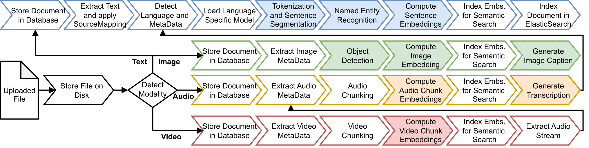

# Preprocessing Pipeline

When you import documents into DATS, they don't just sit on a hard drive. To enable complex semantic searches, automated AI assistance, and high-speed filtering, every file runs through a sophisticated, automated machine-learning pipeline.

The primary goal of this preprocessing pipeline is to convert diverse, multimodal data (images, audio, video) into a **unified, structured text domain**. This ensures that an image, a podcast, and a PDF can all be searched and analyzed together using the same tools.

This chapter provides a technical overview of the models and architecture powering this pipeline.

## 1\. Pipeline Architecture & Execution

The preprocessing pipeline is built as a distributed job system using the **RQ (Redis Queue)** framework.

When you upload a batch of files, DATS automatically detects their modalities and schedules a series of actions (a "flow"). These steps are executed asynchronously and in parallel by background workers. Depending on the task, DATS intelligently routes the job to either CPU-powered or GPU-powered workers (managed via **Ray** and **vLLM** for efficient model serving).

*The multimodal preprocessing pipeline routes files through specific AI models based on their data type.*

## 2\. The Four Modality Flows

Depending on the file uploaded, DATS triggers one of four distinct processing flows.

### 📝 1\. The Text Flow

This is the foundational flow of DATS. It processes standard formats like PDF, DOCX, TXT, and HTML.

1. **Extraction:** DATS uses **Docling** to cleanly extract content from PDFs and Word files. For HTML web pages, it uses **Readability.js** to strip away navigation menus, ads, and irrelevant structure, preserving only the main article text.
2. **Chunking:** To ensure that subsequent Transformer-based language models can process the text within their token limits, large documents are split into smaller chunks (defaulting to 10-page segments).
3. **Language Detection:** The text's language is automatically identified using the **GlotLID** model.
4. **NLP & Entity Recognition:** For supported languages (English, German, Italian), the text is passed through **spaCy** pipelines. This handles tokenization, sentence segmentation, and Named Entity Recognition (NER), automatically identifying people, organizations, and locations.
5. **Semantic Embeddings:** Finally, sentence embeddings are computed using a pre-trained multilingual **CLIP** encoder model (via the SentenceTransformers library). This mathematical representation of the text is what makes the cross-modal semantic search possible\!

### 🖼️ 2\. The Image Flow

This flow converts visual content into a searchable, text-based format.

1. **Object Detection:** A pre-trained **DETR (DEtection TRansformer)** model scans the image to identify and categorize objects (e.g., cars, people, buildings).
2. **Semantic Embedding:** A global semantic image embedding is computed using the same **CLIP** encoder model used in the text flow.
3. **Image Captioning:** An open-weight Large Language Model generates a concise, entity-aware description of the image.
4. **Funnel to Text:** *Crucially, this generated caption is then passed directly into the Text Flow.* This means the image's description undergoes entity recognition and indexing, allowing you to find the image using standard text searches\!

### 🎵 3\. The Audio Flow

This flow makes spoken-word content (like MP3s or WAVs) searchable.

1. **Transcription:** DATS utilizes OpenAI's robust **Whisper** model to perform Automatic Speech Recognition (ASR), generating a highly accurate textual transcription of the audio.
2. **Funnel to Text:** The resulting transcript is treated as a standard text document and passed directly into the Text Flow for chunking, entity recognition, and embedding.

### 🎞️ 4\. The Video Flow

This flow handles standard video formats (like MP4 or MOV).

1. **Audio Extraction:** DATS first strips the audio stream from the video file.
2. **Funnel to Audio:** The extracted audio is immediately sent to the **Audio Flow**, where it is transcribed by Whisper and subsequently indexed by the Text Flow.
3. *(Note: Currently, frame-by-frame visual analysis for videos is ignored, but it is planned for future development).*

## 3\. Data Storage & Retrieval

Once the pipeline finishes processing a document, the resulting structured data is distributed across a highly optimized, heterogeneous database architecture:

* **PostgreSQL:** The core relational database. It stores all project metadata, user data, manual annotations, and the hierarchical structure of your Tags and Codes.
* **Elasticsearch:** An inverted index database used exclusively for the text domain. When you type a word into the main Search Bar, Elasticsearch executes the lightning-fast lexical/fuzzy search.
* **Weaviate:** An advanced vector database. This stores the dense mathematical vectors (embeddings) generated by the CLIP models. When you use the "Find similar sentences" or Perspectives features, Weaviate performs the high-speed spatial similarity calculations.

## 4\. A Note on Data Privacy

Because DATS is designed for academic discourse analysis, data sovereignty is a top priority.

Unlike commercial qualitative tools that send your documents to third-party cloud APIs (like OpenAI or Google) for transcription or LLM analysis, **DATS executes this entire preprocessing pipeline locally**. The Whisper, spaCy, CLIP, and LLM (e.g., Gemma) models are hosted directly on your institutional server, ensuring that sensitive research data never leaves your controlled environment.
