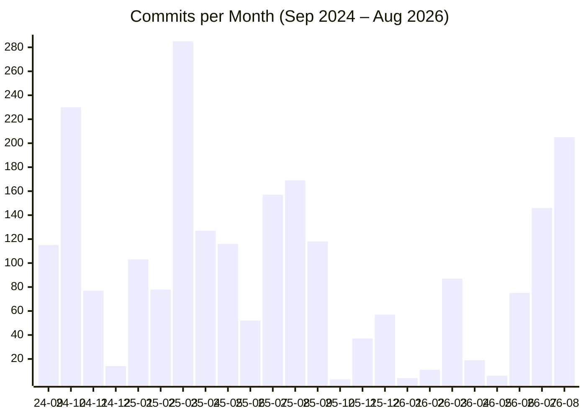

# DATS Development Statistics — September 2024 to August 2026

Quantitative overview of DATS development activity between **2024-09-01** and **2026-08-31**, based on git history of [uhh-lt/dats](https://github.com/uhh-lt/dats) and the quarterly reports in this folder.

> Note: commit-based numbers use commit dates in the given range; a small number of older commits fall into the window due to rebases/merges. PR numbers are taken from the quarterly reports (152 merged PRs total, 154 unique PR references including cross-references).

## 📈 Activity at a Glance

| Metric | Value |
| --- | --- |
| Total commits | **~2,353** |
| Merged pull requests | **152** |
| Releases published | **42** (v1.0.5 → v1.10.4) |
| Lines added | **~424,000** |
| Lines deleted | **~249,000** |
| Net code growth | **~+175,000 lines** |
| Unique files touched | **~5,800** |
| Contributors | **14** (incl. 2 bots) |
| Active months | **24 / 24** — no month without commits |

## 👥 Contributors

| Contributor | Commits | Share |
| --- | ---: | ---: |
| Tim Fischer | 1,970 | ~84% |
| Fynn Petersen-Frey | 84 | ~3.6% |
| floschne | 84 | ~3.6% |
| Alienmaster | 43 | ~1.8% |
| Ahmad Khalidi | 31 | ~1.3% |
| Nasrul Huda | 30 | ~1.3% |
| pre-commit-ci[bot] | 29 | ~1.2% |
| github-actions | 26 | ~1.1% |
| Steve Ali | 21 | ~0.9% |
| Abdullah Abdelhafez | 19 | ~0.8% |
| Robert Geislinger | 11 | ~0.5% |
| Others (3 people) | 5 | ~0.2% |

**12 human contributors** plus 2 automation bots.

## 🗓️ Activity Over Time (commits per month)

| Period | Commits | Highlight |
| --- | ---: | --- |
| **Mar 2025** | 285 | Peak month — search rewrite, analysis features |
| **Oct 2024** | 230 | LLM integration follow-ups, cleanup |
| **Aug 2026** | 205 | Annotator UX overhaul, TanStack Router |
| **Jul 2026** | 146 | v1.10 release cycle |
| **Aug 2025** | 169 | Folder management, import rework |

- **Average:** ~98 commits/month (~3.2 per day)
- **Quietest period:** Oct 2025 – Feb 2026 (only ~100 commits in 5 months)
- **Busiest single days:** 2026-07-15 (32 commits), 2026-08-20 (31), 2026-07-02 (29)

## 🚀 Releases

- **42 releases** in 24 months → **~1.75 releases/month**
- Version journey: **v1.0.5** (2024-09-19) → **v1.10.4** (2026-08-12)
- **10 minor version bumps** (1.0 → 1.10)
- Fastest patch series: **v1.6.x** — 4 patches (v1.6.0–v1.6.3) within one week (April 2025)
- Longest stable stretch: **v1.8.x** — 7 patch releases between Sep 2025 and Dec 2025

## 🧩 Where the Work Happened (file touches per area)

| Area | File touches | Share |
| --- | ---: | ---: |
| `frontend/` | 12,589 | ~60% |
| `backend/` | 6,665 | ~32% |
| `docker/` | 315 | ~1.5% |
| `docs/` | 157 | ~0.8% |
| `.github/` (CI) | 156 | ~0.7% |
| `tools/` | 148 | ~0.7% |
| `ray/` (ML services) | 104 | ~0.5% |

→ Roughly a **2:1 frontend-to-backend ratio** of change activity.

## 📦 Codebase Size (end of period)

| Part | Files | Lines of code |
| --- | ---: | ---: |
| Frontend (TS/TSX, `frontend/src`) | 1,339 | ~90,500 |
| Backend (Python, `backend/src`) | 435 | ~59,800 |
| Backend tests (`backend/test`) | — | ~11,700 |
| **Total (TS/TSX + PY)** | — | **~182,000** |

- Frontend dependency growth: **37 → 50** runtime deps, **21 → 29** dev deps
- Backend: **56** direct dependencies (after the `uv` migration, #531)

## 🔥 Hotspot Files (most frequently changed)

| File | Changes | Why it's hot |
| --- | ---: | --- |
| `frontend/src/openapi.json` | 231 | Regenerated on every API change |
| `docker/.env.example` | 97 | Constantly evolving configuration |
| `frontend/package.json` | 72 | Dependency updates |
| `backend/pyproject.toml` | 67 | Dependency updates |
| `docker/compose.yml` | 61 | Infrastructure evolution |
| `frontend/src/api/QueryKey.ts` | 59 | React Query key governance |
| `backend/src/main.py` | 47 | Endpoint registration hub |

## 🗂️ PRs per Quarter (from quarterly reports)

| Quarter | PRs | Theme |
| --- | ---: | --- |
| 2024-Q3 (Sep) | 13 | LLM integration kickoff & cleanup |
| 2024-Q4 | 31 | LLM assistant, annotation scaling |
| 2025-Q1 | 28 | Search rewrite, analysis features |
| 2025-Q2 | 14 | Import rework, whiteboard |
| 2025-Q3 | 34 | Folder management, RQ migration, backend layering |
| 2025-Q4 | 5 | Consolidation |
| 2026-Q1 | 0* | Quiet quarter (few merges) |
| 2026-Q2 | 9 | Classifier training, perspectives on GPU |
| 2026-Q3 (Jul–Aug) | 20 | Annotator UX overhaul, TanStack Router, SSO |

\* 2026-Q1 had commit activity but no PRs recorded in the quarterly report.

## 🎯 Headline Numbers

1. **~2,350 commits**, **152 PRs**, and **42 releases** in 24 months.
2. Codebase grew by **~175k net lines** to **~182k LOC** (TS/TSX + Python).
3. **60% of change activity** happened in the frontend — reflecting the heavy UX work (annotator, search, whiteboard, perspectives).
4. Development was driven mostly by **1 core developer (~84% of commits)** with **11 additional human contributors**.
5. Peak productivity: **March 2025 (285 commits)** and **August 2026 (205 commits)** — the latter driven by the annotator UX overhaul.
6. Release cadence of **~1.75 releases/month** sustained over the entire two-year window.
